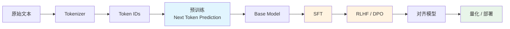
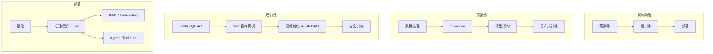

# LLM 训练工程师完全指南

> 从 Tokenizer 到 Post-Training，从单卡到万卡集群，从纯文本到多模态。

面向想系统掌握 LLM 全栈训练能力的工程师。覆盖理论、工程、SOTA 和实战。

## 全景图

## 章节目录

| # | 章节 | 内容 |
|---|------|------|
| 1 | [Tokenizer](chapters/01-tokenizer.md) | BPE, WordPiece, Unigram, 多语言, 字节级 |
| 2 | [模型架构](chapters/02-architecture.md) | Transformer, RoPE, GQA, MoE, MLA, Scaling Laws |
| 3 | [预训练](chapters/03-pretraining.md) | 数据 pipeline, 训练目标, 优化器, 稳定性, 长上下文 |
| 4 | [后训练](chapters/04-post-training.md) | SFT, RLHF, DPO, GRPO, Reasoning Models |
| 5 | [参数高效微调 PEFT](chapters/05-peft.md) | LoRA, QLoRA, Adapters, 实战建议 |
| 6 | [训练基础设施](chapters/06-infra.md) | GPU, TP/PP/DP/EP, 框架, 容错, MFU |
| 7 | [推理与部署](chapters/07-inference.md) | KV Cache, 量化, vLLM, Speculative Decoding, 成本估算 |
| 8 | [Embedding 与 RAG](chapters/08-embedding-rag.md) | Embedding 模型, 向量检索, RAG pipeline |
| 9 | [多模态](chapters/09-multimodal.md) | VLM, 图像生成, 音频, 视频, Omni Models |
| 10 | [安全与对齐](chapters/10-safety-alignment.md) | 评估 Benchmark, Red Teaming, Guardrails, 结构化输出 |
| 11 | [SOTA 模型解析](chapters/11-sota-models.md) | LLaMA 3, DeepSeek, Claude, Gemini, GPT-4, Qwen |
| 12 | [知识蒸馏与模型合并](chapters/12-distillation-merging.md) | KD, TIES, DARE, mergekit |
| 13 | [实战路线图](chapters/13-roadmap.md) | 学习路径, 论文清单, 资源, 硬件, 成本 |

## 训练成本速查

| 模型规模 | 硬件 | 训练 Token | 大约成本 | 时间 |
|----------|------|-----------|---------|------|
| 1B | 1x A100 80GB | 20B | ~$500 | ~2天 |
| 7B | 8x A100 80GB | 1T | ~$50K | ~2周 |
| 13B | 32x A100 80GB | 2T | ~$200K | ~3周 |
| 70B | 256x H100 | 2T | ~$2M | ~1月 |
| 405B | 16384x H100 | 15T | ~$50M+ | ~2月 |
| 671B MoE | 2048x H800 | 14.8T | ~$5.5M | ~2月 |

> 最后一行是 DeepSeek-V3，MoE 架构大幅降低了成本。

## 快速开始

如果你完全是新手，按这个顺序读：

1. [第一章 Tokenizer](chapters/01-tokenizer.md) — 理解输入
2. [第二章 架构](chapters/02-architecture.md) — 理解模型
3. [第十三章 路线图](chapters/13-roadmap.md) — 知道学什么、用什么工具
4. 动手：跑 [nanoGPT](https://github.com/karpathy/nanoGPT)
5. 再回来读剩下的章节

如果你有基础，直接跳到感兴趣的章节。

## 关键链接

| 资源 | 链接 |
|------|------|
| nanoGPT | [github.com/karpathy/nanoGPT](https://github.com/karpathy/nanoGPT) |
| HuggingFace TRL | [github.com/huggingface/trl](https://github.com/huggingface/trl) |
| vLLM | [github.com/vllm-project/vllm](https://github.com/vllm-project/vllm) |
| Megatron-LM | [github.com/NVIDIA/Megatron-LM](https://github.com/NVIDIA/Megatron-LM) |
| Flash Attention | [github.com/Dao-AILab/flash-attention](https://github.com/Dao-AILab/flash-attention) |
| LLM Evaluation | [github.com/EleutherAI/lm-evaluation-harness](https://github.com/EleutherAI/lm-evaluation-harness) |
| Chatbot Arena 排行榜 | [huggingface.co/spaces/lmsys/chatbot-arena-leaderboard](https://huggingface.co/spaces/lmsys/chatbot-arena-leaderboard) |

---

> 最后更新: 2026-04-25
