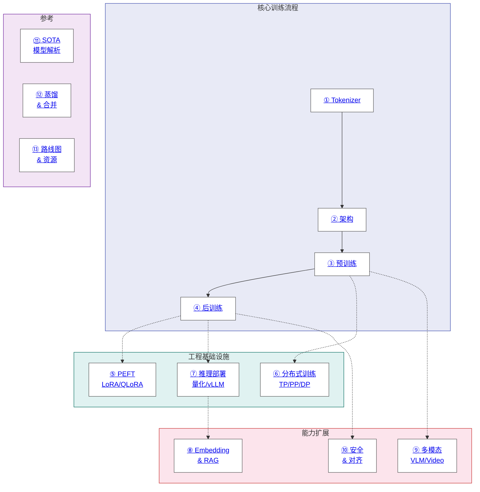

# LLM 训练工程师完全指南

> 从分词表征到后训练对齐，从单卡微调到万卡集群调度，从纯文本理解到多模态统一基座。

系统性拆解大语言模型全栈训练技术体系，贯通底层数学物理机理、核心算法推演、工业级分布式工程与前沿 SOTA 实践。

**[English Version](en/README.md)** | **在线阅读**：[yingwang.github.io/llm-tutorial](https://yingwang.github.io/llm-tutorial/)

## 全景图: 从数据到部署

```mermaid
flowchart LR
    subgraph DATA["<b>① 数据</b>"]
        D1["Web Crawl\nWikipedia\n代码/数学"] --> D2["清洗\n去重\n过滤"]
    end

    subgraph TOK["<b>② Tokenizer</b>"]
        D2 --> T1["BPE / Unigram\n训练词表"]
        T1 --> T2["Token IDs"]
    end

    subgraph PRE["<b>③ 预训练</b>"]
        T2 --> P1["Transformer\nGQA · MoE · MLA\nRoPE · SwiGLU"]
        P1 --> |"Next Token\nPrediction"| P2["Base Model"]
    end

    subgraph POST["<b>④ 后训练</b>"]
        P2 --> S1["SFT\n指令微调"]
        S1 --> S2["RLHF / DPO\n偏好优化"]
        S2 --> S3["Safety\n安全训练"]
    end

    subgraph DEPLOY["<b>⑤ 部署</b>"]
        S3 --> Q1["量化\nINT4/FP8"]
        Q1 --> Q2["推理服务\nvLLM · SGLang"]
    end

    classDef step fill:#ffffff,stroke:#555,color:#222
    class D1,D2,T1,T2,P1,P2,S1,S2,S3,Q1,Q2 step

    style DATA fill:#e3f2fd,stroke:#1565c0,color:#0d47a1
    style TOK fill:#e3f2fd,stroke:#1565c0,color:#0d47a1
    style PRE fill:#e8eaf6,stroke:#283593,color:#1a237e
    style POST fill:#fff3e0,stroke:#e65100,color:#bf360c
    style DEPLOY fill:#e8f5e9,stroke:#2e7d32,color:#1b5e20
```



## 知识地图: 章节关系



## 章节目录

| # | 章节 | 内容 |
|---|------|------|
| 1 | [Tokenizer](chapters/01-tokenizer.md) | BPE, WordPiece, Unigram, 多语言, 字节级 |
| 2 | [模型架构](chapters/02-architecture.md) | Transformer, RoPE, GQA, MoE, MLA, Scaling Laws |
| 3 | [预训练](chapters/03-pretraining.md) | 数据 pipeline, 训练目标, 优化器, 稳定性, 长上下文 |
| 4 | [后训练](chapters/04-post-training.md) | SFT, RLHF, DPO, GRPO, Reasoning Models |
| 5 | [参数高效微调 PEFT](chapters/05-peft.md) | LoRA, QLoRA, Adapters, 实战建议 |
| 6 | [训练基础设施](chapters/06-infra.md) | GPU, TP/PP/DP/EP, 框架, 容错, MFU |
| 7 | [推理与部署](chapters/07-inference.md) | KV Cache, 量化, vLLM, Speculative Decoding, 成本估算 |
| 8 | [Embedding 与 RAG](chapters/08-embedding-rag.md) | Embedding 模型, 向量检索, RAG pipeline |
| 9 | [多模态](chapters/09-multimodal.md) | VLM, 图像生成, 音频, 视频, Omni Models |
| 10 | [安全与对齐](chapters/10-safety-alignment.md) | 评估 Benchmark, Red Teaming, Guardrails, 结构化输出 |
| 11 | [SOTA 模型解析](chapters/11-sota-models.md) | LLaMA 3, DeepSeek, Claude, Gemini, GPT-4, Qwen |
| 12 | [知识蒸馏与模型合并](chapters/12-distillation-merging.md) | KD, TIES, DARE, mergekit |
| 13 | [实战路线图](chapters/13-roadmap.md) | 学习路径, 论文清单, 资源, 硬件, 成本 |

## 训练成本速查

| 模型规模 | 硬件 | 训练 Token | 大约成本 | 时间 |
|----------|------|-----------|---------|------|
| 1B | 1x A100 80GB | 20B | ~$500 | ~2天 |
| 7B | 8x A100 80GB | 1T | ~$50K | ~2周 |
| 13B | 32x A100 80GB | 2T | ~$200K | ~3周 |
| 70B | 256x H100 | 2T | ~$2M | ~1月 |
| 405B | 16384x H100 | 15T | ~$50M+ | ~2月 |
| 671B MoE | 2048x H800 | 14.8T | ~$5.5M | ~2月 |

> 注：表中 DeepSeek-V3 凭借细粒度 MoE 稀疏激活与 FP8 混合精度训练，实现了计算效率与显存开销的跨越式压缩。

## 配套代码

本教程配套的可运行工程代码存放于独立仓库 **[llm-tutorial-code](https://github.com/yingwang/llm-tutorial-code)**。仓库按章节模块化组织，从手写 BPE 分词器与基础注意力算子起步，逐层递进至大规模预训练流水线、SFT、DPO 对齐、LoRA 微调及高性能推理部署。

## 术语表

若在阅读过程中遇到专业缩写或前沿概念，可随时查阅 **[术语表](chapters/00-glossary.md)**。该表系统归纳了模型架构、训练机制、参数高效微调、分布式基础设施、推理加速、检索增强生成（RAG）以及多模态等维度的 80 余个核心技术词条。

## 推荐阅读路径

针对初学者，建议遵循由浅入深、理论与代码共振的研读顺序：

1. [第一章 Tokenizer](chapters/01-tokenizer.md)：剖析离散符号到连续向量的离散化表征入口
2. [第二章 架构](chapters/02-architecture.md)：洞悉 Transformer 骨干网络、位置编码与前沿注意力演进
3. [第十三章 路线图](chapters/13-roadmap.md)：把握大模型工程师的全局技能图谱与软硬件工具链
4. 动手实践：复现并运行 [nanoGPT](https://github.com/karpathy/nanoGPT)
5. 进阶深造：系统研读预训练、后训练、分布式系统与推理优化等核心专题

具备相关背景的研发人员，亦可结合工程实际需求按模块选读。

## 关键链接

| 资源 | 链接 |
|------|------|
| nanoGPT | [github.com/karpathy/nanoGPT](https://github.com/karpathy/nanoGPT) |
| HuggingFace TRL | [github.com/huggingface/trl](https://github.com/huggingface/trl) |
| vLLM | [github.com/vllm-project/vllm](https://github.com/vllm-project/vllm) |
| Megatron-LM | [github.com/NVIDIA/Megatron-LM](https://github.com/NVIDIA/Megatron-LM) |
| Flash Attention | [github.com/Dao-AILab/flash-attention](https://github.com/Dao-AILab/flash-attention) |
| LLM Evaluation | [github.com/EleutherAI/lm-evaluation-harness](https://github.com/EleutherAI/lm-evaluation-harness) |
| Chatbot Arena 排行榜 | [huggingface.co/spaces/lmsys/chatbot-arena-leaderboard](https://huggingface.co/spaces/lmsys/chatbot-arena-leaderboard) |

## 作者

Ying Wang

## 引用

若本教程对你的研究或工程实践有所启发，欢迎援引：

```bibtex
@misc{wang2026llmtutorial,
  author = {Ying Wang},
  title  = {LLM 训练工程师完全指南 / The Complete LLM Training Engineer Guide},
  year   = {2026},
  url    = {https://github.com/yingwang/llm-tutorial}
}
```

## 许可证

本仓库采用**双重许可**：

- **正文与示意图**（包括 Mermaid 流程图、解释性文字、章节内容）：[CC BY-NC-SA 4.0](LICENSE)（署名 · 非商业 · 相同方式共享）
- **代码片段**（章节中的 Python/Bash 等示例）：[MIT](LICENSE-CODE)（自由使用，含商业用途，仅需保留版权声明）

在学习或工程实践中复用本仓库的代码示例，不受非商业性条款限制。

---

> 最后更新: 2026-04-26
