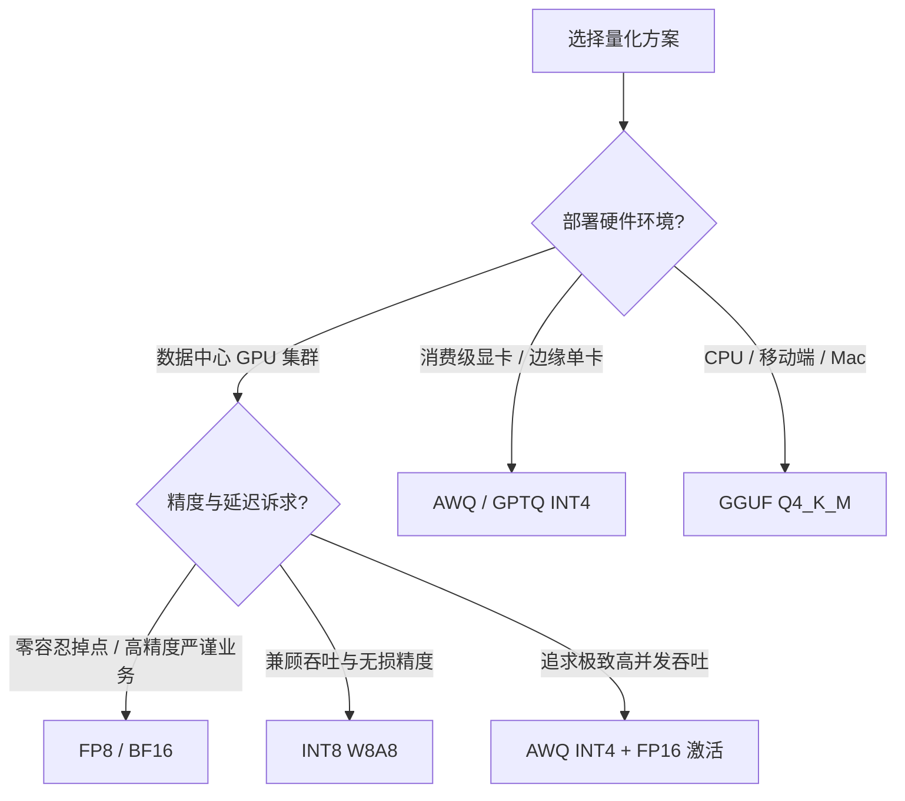

[← 上一章](06-infra.md) | [目录](../README.md) | [下一章 →](08-embedding-rag.md)

# 第七章：推理与部署

大语言模型的生命周期中，训练决定能力的上限，而推理与部署则决定技术落地的效率边界。与传统深度学习不同，自回归生成机制使得大模型推理呈现出鲜明的两阶段特征：计算密集（Compute-Bound）的 Prefill 阶段与显存带宽受限（Memory-Bound）的 Decode 阶段。本章将从底层计算原理出发，系统解析 KV Cache 优化、量化压缩、动态批处理、推测解码与结构化输出等核心工程技术。

## 7.1 KV Cache 与显存墙

自回归模型在逐词生成下一个 token 时，依赖于此前所有 token 的注意力上下文。若不进行中间状态缓存，每一步生成都需要将历史序列重新过一遍前向传播，整体计算复杂度将退化为 $O(n^2)$。

```
自回归生成时，每个新 token 需要和所有前文做 attention
朴素方案: 每次重新计算全部 K, V 序列 → 步进复杂度 O(n²) per token

KV Cache: 缓存历史计算所得的 K, V 矩阵，每一步仅计算新 token 的 Q, K, V
→ 计算复杂度降为 O(n) per token
→ 但历史状态必须驻留于显存: 2 × layers × kv_heads × head_dim × seq_len × bytes_per_element

以 70B 模型为例 (80 层, 8 个 KV 头, head_dim=128, BF16 精度, 128K 上下文):
KV cache 单请求占用 ≈ 2 × 80 × 8 × 128 × 131072 × 2 Byte ≈ 42.95 GB
```

在 Decode 阶段，单步生成只输入一个 token，矩阵乘法退化为矩阵向量乘（GEMV）。此时算力利用率（Arithmetic Intensity）极低，计算核心大部分时间在等待显存向计算单元搬运权重与 KV 缓存。这就是大模型推理所面临的“显存墙”挑战。

**KV Cache 显存优化范式**:
- **GQA（分组查询注意力）**: 缩减 KV 头数，直接降低显存占用与带宽读取开销（[见第二章](02-architecture.md#231-grouped-query-attention-gqa)）。
- **MLA（多头潜在注意力）**: 将高维 KV 投影至低维潜在流形中压缩存储，解码时动态投影还原，显存占用降低达 90% 以上（[见第二章](02-architecture.md#233-multi-head-latent-attention-mla)）。
- **PagedAttention（分页注意力）**: 借鉴操作系统虚拟内存分页机制，将连续的 KV Cache 离散分配在非连续物理块中，彻底消除内部显存碎片（[vLLM](https://github.com/vllm-project/vllm)）。
- **KV Cache 量化**: 将动态生成的 KV Cache 由 FP16/BF16 压缩至 INT8 或 FP8 格式存储，显存消耗减半且保持极高精度。

## 7.2 量化推理

模型量化（Quantization）通过将高精度浮点权重与激活值映射至低位宽整数或紧凑浮点格式，降低显存占用并成倍提升显存带宽的有效吞吐。

| 方法 | 精度 | 吞吐提升 | 质量损失 | 核心适用场景 |
|------|------|---------|---------|-------------|
| BF16 | 16-bit | 1x (基准) | 无损失 | 精度敏感型核心生产服务 |
| INT8 (W8A8) | 8-bit | ~1.8x - 2x | 极小 | 企业级高并发生产服务 |
| FP8 (E4M3/E5M2) | 8-bit | ~2x - 2.5x | 极小 | Ada/Hopper 架构 GPU 吞吐优化 |
| INT4 ([GPTQ](https://arxiv.org/abs/2210.17323)/[AWQ](https://arxiv.org/abs/2306.00978)) | 4-bit | ~3x - 4x | 轻微 | 单卡部署大模型（如 4090 运行 70B） |
| GGUF Q4_K_M | 4-bit 混合 | ~3x - 4x | 轻微 | 本地 CPU / Apple Silicon 推理 |
| INT2-3 (AQLM/QuIP#) | 2-3 bit | ~5x+ | 较明显 | 极端显存受限环境研究 |

**主流量化算法机理**:
- **GPTQ (Generalized Post-Training Quantization)**: 基于二阶泰勒展开与逆海森矩阵（Inverse Hessian），以列为单位贪心量化权重，并在未量化权重上实时补偿量化误差。
- **AWQ (Activation-aware Weight Quantization)**: 发现激活值幅值较大的通道（Salient Channels）对模型能力起决定性作用，通过逐通道缩放保护前 1% 的关键权重，无须重训即可获得极高保真度。
- **GGUF / llama.cpp**: 针对跨硬件端侧生态设计的混合精度块量化格式，支持图计算与 CPU/GPU 混合显存切分调度。

### 量化技术选型决策



## 7.3 高性能推理引擎

现代推理引擎通过算子融合（Kernel Fusion）、内存复用与动态调度，最大化释放底层硬件算力。

| 框架 | 核心技术亮点 | 最佳适用场景 |
|------|------------|-------------|
| [**vLLM**](https://github.com/vllm-project/vllm) | PagedAttention, Continuous Batching, Chunked Prefill | 通用生产环境高并发部署首选 |
| [**TensorRT-LLM**](https://github.com/NVIDIA/TensorRT-LLM) | 深度融合 CUDA 算子, 极致 FP8/INT4 Tensor Core 优化 | NVIDIA GPU 极限吞吐与最低延迟 |
| [**SGLang**](https://github.com/sgl-project/sglang) | RadixAttention 前缀树缓存, 结构化生成加速 | Complex Prompts / Multi-turn Agent 场景 |
| [**llama.cpp**](https://github.com/ggerganov/llama.cpp) | 纯 C/C++ 实现, 无外部依赖, 广泛支持 ARM/Metal/AVX | 本地轻量化部署与跨平台端侧运行 |
| [**MLC-LLM**](https://github.com/mlc-ai/mlc-llm) | TVM 编译优化驱动, 跨平台代码生成 | 跨异构硬件与移动端应用 |
| [**Ollama**](https://ollama.com/) | 封装 llama.cpp 后端, 提供类 Docker 的模型管理接口 | 个人开发者快速实验与本地服务 |

### vLLM 快速部署示例

```bash
# 安装推理引擎
pip install vllm

# 启动 OpenAI 兼容格式的 API 服务
vllm serve meta-llama/Llama-3-8B-Instruct \
    --dtype bfloat16 \
    --max-model-len 8192 \
    --gpu-memory-utilization 0.9

# 发送请求测试 (完全兼容 OpenAI 协议接口)
curl http://localhost:8000/v1/chat/completions \
    -H "Content-Type: application/json" \
    -d '{"model": "meta-llama/Llama-3-8B-Instruct", "messages": [{"role": "user", "content": "Hello"}]}'
```

### 关键机制: 连续批处理 (Continuous Batching)

传统静态批处理以请求为粒度进行对齐，长短请求混杂时会产生严重的“气泡等待”（Padding Bubble）。连续批处理（又称迭代级调度，Iteration-level Scheduling）打破了请求边界，在每个生成步动态插入完成 Prefill 的新请求或剔除已生成完毕的请求。

```
传统 Static Batching:
  请求 A (100 tokens) ─────────────────────────▶ 结束
  请求 B (30 tokens)  ──────────▶ 完成 [等待A结束...]
  请求 C (50 tokens)  ────────────────▶ 完成 [等待A结束...]
  → 显存与计算单元被短请求的空白填充严重浪费

Continuous Batching (vLLM / TensorRT-LLM):
  请求 A ─────────────────────────▶ 结束
  请求 B ──────────▶ 完成 → 动态插入请求 D ─────▶ 结束
  请求 C ────────────────▶ 完成 → 动态插入请求 E ──▶
  → 请求随时接入与退出，GPU 算力利用率持续饱和
```

## 7.4 推测解码 (Speculative Decoding)

推测解码（[Leviathan et al., 2023](https://arxiv.org/abs/2211.17192)）通过算法创新攻克了自回归解码的显存带宽瓶颈。

```
物理本质: 自回归生成受限于显存带宽，单步前向传播仅计算 1 个 token，算力被闲置。
解决思路: 引入体量小、速度极快的小模型（草稿模型 Draft Model）快速生成候选序列，
         再由大模型（目标模型 Target Model）通过单次前向传播对所有候选 token 进行并行验证。

Draft model: 迅速投机生成候选序列 [t1, t2, t3, t4, t5] (共 5 个 tokens)
Target model: 构造特定掩码，单次前向并行验证 → 接受 [t1, t2, t3]，拒绝 t4 → 在 t3 基础上校正重采样

收益产出: 目标模型仅耗费一次前向时间，便输出了多个被严格验证的 token。
         系统吞吐提升 2 至 3 倍，且数学上严格保证输出概率分布与单纯由大模型采样完全一致。
```

**前沿推测架构演进**:
- **EAGLE / EAGLE-2** ([Li et al., 2024](https://arxiv.org/abs/2401.15077)): 直接重用目标模型顶层特征向量作为草稿输入，结合树状注意力验证，使候选接受率大幅提升。
- **Medusa** ([Cai et al., 2024](https://arxiv.org/abs/2401.10774)): 无须外挂独立小模型，在主模型顶部挂载多个轻量级预测头（Medusa Heads），利用树状注意力单步投机生成多个后续 token。

## 7.5 结构化输出 (Structured Generation)

在大模型 Agent、工具调用与系统集成中，保证模型输出严格遵从指定的语法或 Schema 是确定性工程落地的基石。

### 7.5.1 JSON 模式与约束解码

**方案一: 约束解码 (Constrained Decoding / Logit Masking)**
在推理采样的每一步，通过有限状态机（FSM）或语法解析器（CFG）动态计算当前允许出现的合法 Token 集合，将非法 Token 的 Logit 强制置为 $-\infty$。

```python
# vLLM / SGLang 原生支持基于 JSON Schema 的语法约束
from pydantic import BaseModel

class WeatherQuery(BaseModel):
    city: str
    unit: str = "celsius"

# 推理引擎会在采样阶段动态剪枝，强制仅输出符合 Schema 的合法 JSON 序列
response = client.chat.completions.create(
    model="llama-3-8b-instruct",
    messages=[{"role": "user", "content": "What's the weather in Stockholm?"}],
    response_format={
        "type": "json_schema",
        "json_schema": WeatherQuery.model_json_schema()
    }
)
```

**方案二: 引导生成 (Guided Generation via [Outlines](https://github.com/dottxt-ai/outlines))**
将正则表达式或 Pydantic 模型提前编译为确定性有限状态自动机（DFA），在推理引擎底层实现毫秒级 Logit 动态掩码计算。

```python
import outlines

model = outlines.models.transformers("meta-llama/Llama-3-8B-Instruct")
generator = outlines.generate.json(model, WeatherQuery)
result = generator("What's the weather in Stockholm?")
# 严格返回实例: WeatherQuery(city='Stockholm', unit='celsius')
```

### 7.5.2 函数调用 (Function Calling / Tool Use)

大模型通过标准协议与外部环境交互，其核心是将工具的参数规格转为 Prompt 上下文，并要求模型生成符合规范的调用签名。

```python
tools = [{
    "type": "function",
    "function": {
        "name": "get_weather",
        "description": "Get current weather for a given location",
        "parameters": {
            "type": "object",
            "properties": {
                "city": {"type": "string"},
                "unit": {"type": "string", "enum": ["celsius", "fahrenheit"]}
            },
            "required": ["city"]
        }
    }
}]

response = client.chat.completions.create(
    model="gpt-4",
    messages=[{"role": "user", "content": "Weather in Stockholm?"}],
    tools=tools,
)
# 解析模型输出获得工具调用: {"name": "get_weather", "arguments": {"city": "Stockholm", "unit": "celsius"}}
```

## 7.6 成本建模与工程经济学

### 7.6.1 训练成本数学估算

大模型预训练的理论浮点运算量约为 $6ND$（前向传播 $2ND$，反向传播 $4ND$）。结合硬件峰值算力与模型浮点利用率（MFU），训练总耗时与成本可量化表示为：

$$T_{\text{hours}} \approx \frac{6 \times N \times D}{\text{GPU\_FLOPS} \times \text{MFU} \times n_{\text{GPUs}} \times 3600}$$

$$\text{Cost} = T_{\text{hours}} \times n_{\text{GPUs}} \times P_{\text{GPU-hour}}$$

```
参数释义:
N = 模型参数量 (稠密参数)
D = 训练总 Token 规模
GPU_FLOPS = 硬件理论浮点峰值 (如 H100 SXM BF16 算力约为 989 TFLOPS)
MFU = 实际模型浮点利用率 (典型取值 0.35 - 0.50)
P_GPU-hour = 单卡每小时租赁成本

测算案例: 训练 7B 模型, 消耗 1T tokens, 采用 8 张 H100 节点:
计算量 = 6 × 7e9 × 1e12 = 4.2e22 FLOPs
集群算力 = 989e12 × 0.40 (MFU) × 8 = 3.16e15 FLOPs/s
训练耗时 = 4.2e22 / (3.16e15 × 3600) ≈ 3691 小时 ≈ 153.8 卡天 ≈ 19.2 天 (8卡并行)
总体硬件成本: 19.23 天 × 24 小时 × 8 卡 × $3.5 / 卡时 ≈ $12,920
```

### 7.6.2 云算力参考基准 (2025/2026)

| 硬件规格 | 按需单价参考 | 预留/包月单价 | 显存与互连特性 | 适用阶段 |
|---------|------------|--------------|--------------|---------|
| A100 80GB SXM | ~$2.0 / hr | ~$1.2 / hr | 80GB HBM2e, NVLink 600GB/s | 稳定训练与生产部署 |
| H100 80GB SXM | ~$3.5 / hr | ~$2.0 / hr | 80GB HBM3, NVLink 900GB/s | 大规模预训练与微调主力 |
| H200 141GB SXM | ~$4.5 / hr | ~$2.8 / hr | 141GB HBM3e, 4.8TB/s 带宽 | 超长上下文与巨型 MoE 推理 |
| RTX 4090 24GB | ~$0.5 / hr | ~$0.3 / hr | 24GB GDDR6X, PCIe 4.0 | 个人实验、轻量微调与原型验证 |

### 7.6.3 推理成本核心指标与降本策略

大模型在线推理系统需持续权衡以下四个核心维度：
- **首字延迟 (TTFT, Time-to-First-Token)**: 受 Prefill 吞吐主导，属于计算密集型阶段。
- **输出吞吐 (TPOT, Time-per-Output-Token)**: 受 Decode 显存带宽与 KV Cache 搬运主导。
- **百万 Token 成本 ($/1M Tokens)**: 系统吞吐量与集群资源利用率的直接反映。
- **并发服务容量 (Queries Per Second, QPS)**: 系统在延迟达标约束下的并发峰值。

**全栈工程降本路径**:
1. **精度量化 (FP8 / AWQ INT4)**: 在相同显存预算下容纳 2 至 4 倍批大小，显著提升有效显存带宽利用率。
2. **前缀缓存 (Prefix / Radix Caching)**: 对共享的 System Prompt 或多轮历史仅执行一次 Prefill，消除重复前向计算。
3. **分层分流路由 (Tiered Routing)**: 采用分类路由器将简单指令分发至小尺寸模型（如 8B），复杂逻辑交由头部旗舰模型（如 70B/MoE）。
4. **推测解码与异步流水线**: 压缩单请求端到端响应延迟，释放计算核心并发潜力。

## 关键论文

- [Kwon et al. (2023): vLLM: Efficient Memory Management for Large Language Models with PagedAttention](https://arxiv.org/abs/2309.06180)：基于分页虚拟内存思想彻底重构 KV 缓存管理。
- [Leviathan et al. (2023): Fast Inference from Transformers via Speculative Decoding](https://arxiv.org/abs/2211.17192)：推测解码奠基性工作，实现严谨无损的推理加速。
- [Cai et al. (2024): Medusa: Simple LLM Inference Acceleration Framework with Multiple Decoding Heads](https://arxiv.org/abs/2401.10774)：单模型多头并行推测生成框架。
- [Frantar et al. (2022): GPTQ: Accurate Post-Training Quantization for Generative Pre-trained Transformers](https://arxiv.org/abs/2210.17323)：二阶误差补偿的高精度 4-bit 权重量化。
- [Lin et al. (2023): AWQ: Activation-aware Weight Quantization for LLM Compression and Acceleration](https://arxiv.org/abs/2306.00978)：基于激活分布感知的权重保护量化范式。

## 进阶参考

- [vLLM](https://github.com/vllm-project/vllm) / [SGLang](https://github.com/sgl-project/sglang) / [TensorRT-LLM](https://github.com/NVIDIA/TensorRT-LLM)：现代工业级推理引擎实现与源码剖析。
- [llama.cpp](https://github.com/ggerganov/llama.cpp)：CPU 与端侧推理极致优化的工程典范。
- Hao Zhang: [Towards 100x Speedup: Full Stack Transformer Inference Optimization](https://yaofu.notion.site/Towards-100x-Speedup-Full-Stack-Transformer-Inference-Optimization-43124c3688e14cffaf2f1d6cbdf26c39)：大模型全栈推理优化知识库。

## 练习题

1. **吞吐性能实测**: 选取标准模型（如 Qwen2.5-7B），分别基于原生 HuggingFace pipeline、vLLM 以及 SGLang 搭建推理服务，在 100 并发压力下对比测试 TTFT、TPOT 与整体系统每秒 Token 吞吐。
2. **量化保真度评测**: 使用 AWQ 与 GPTQ 将 Llama-3-8B 量化为 4-bit 精度，在 GSM8K 与 MMLU 基准上对比评测各方案的精度掉点幅度与显存占用节省比。
3. **推测解码实战**: 以 Llama-3-8B 为目标模型、TinyLlama-1.1B 为草稿模型搭建推测解码系统，针对不同长度与任务类型的 Prompt 记录 Token 接受率（Acceptance Rate）与端到端实际加速比。

---

[← 上一章](06-infra.md) | [目录](../README.md) | [下一章 →](08-embedding-rag.md)
