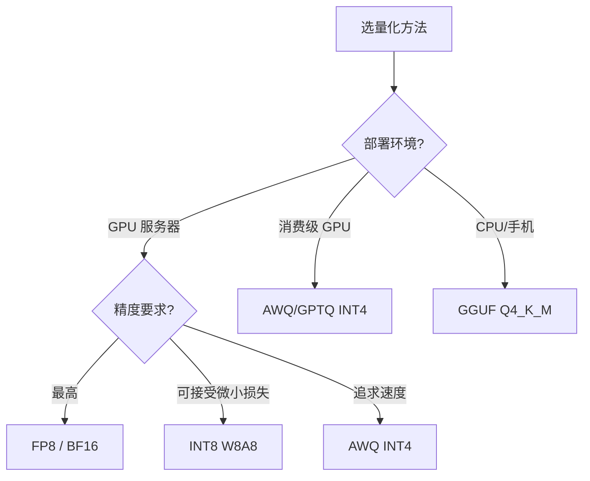

[← 上一章](06-infra.md) | [目录](../README.md) | [下一章 →](08-embedding-rag.md)

# 第七章：推理与部署

## 7.1 KV Cache

```
自回归生成时，每个新 token 需要和所有前文做 attention
朴素: 每次重算所有 K, V → O(n²) per token

KV Cache: 缓存历史 K, V，每次只计算新 token 的 K, V
→ O(n) per token
→ 但缓存占内存: 2 * layers * kv_heads * head_dim * seq_len * bytes

70B 模型, 128K context, BF16:
KV cache ≈ 2 * 80 * 8 * 128 * 128K * 2 ≈ 42GB per request!
```

**KV Cache 优化**:
- **GQA**: KV heads 减少 → cache 减少 ([见第二章](02-architecture.md#231-gqa-grouped-query-attention))
- **MLA**: 压缩到 latent → cache 大幅减少 ([见第二章](02-architecture.md#233-mla-multi-head-latent-attention))
- **PagedAttention** ([vLLM](https://github.com/vllm-project/vllm)): 用虚拟内存分页管理 KV cache，消除碎片
- **KV Cache Quantization**: 把 KV cache 量化到 INT8/FP8

## 7.2 量化推理

| 方法 | 精度 | 速度提升 | 质量损失 |
|------|------|---------|---------|
| BF16 | 16-bit | 1x (baseline) | 无 |
| INT8 (W8A8) | 8-bit | ~2x | 极小 |
| FP8 | 8-bit | ~2x | 极小 |
| INT4 ([GPTQ](https://arxiv.org/abs/2210.17323)/[AWQ](https://arxiv.org/abs/2306.00978)) | 4-bit | ~3-4x | 小 |
| GGUF Q4_K_M | 4-bit mixed | ~3-4x | 小 |
| INT2-3 | 2-3 bit | ~5x+ | 明显 |

**GPTQ**: Post-training quantization，用校准数据最小化量化误差
**AWQ**: Activation-aware Weight Quantization，保护 salient weights
**GGUF**: [llama.cpp](https://github.com/ggerganov/llama.cpp) 格式，CPU/GPU 混合推理

### 怎么选量化方法



## 7.3 推理框架

| 框架 | 特点 | 适用 |
|------|------|------|
| [**vLLM**](https://github.com/vllm-project/vllm) | PagedAttention, continuous batching | 生产部署首选 |
| [**TensorRT-LLM**](https://github.com/NVIDIA/TensorRT-LLM) | NVIDIA 优化, FP8 | 最大吞吐 |
| [**SGLang**](https://github.com/sgl-project/sglang) | RadixAttention, prefix caching | 复杂 prompt / agent |
| [**llama.cpp**](https://github.com/ggerganov/llama.cpp) | CPU/Apple Silicon, GGUF | 本地推理 |
| [**MLC-LLM**](https://github.com/mlc-ai/mlc-llm) | 编译优化, 多平台 | 端侧 |
| [**Ollama**](https://ollama.com/) | 封装 llama.cpp, 一键部署 | 个人使用 |

### vLLM 快速部署

```bash
# 安装
pip install vllm

# 启动 OpenAI 兼容 API server
vllm serve meta-llama/Llama-3-8B-Instruct \
    --dtype bfloat16 \
    --max-model-len 8192 \
    --gpu-memory-utilization 0.9

# 使用 (和 OpenAI API 完全兼容)
curl http://localhost:8000/v1/chat/completions \
    -H "Content-Type: application/json" \
    -d '{"model": "meta-llama/Llama-3-8B-Instruct", "messages": [{"role": "user", "content": "Hello"}]}'
```

### 关键概念: Continuous Batching

```
传统 Static Batching:
  请求 A (100 tokens) ─────────────────────────▶ done
  请求 B (30 tokens)  ──────────▶ done [等A完...]
  请求 C (50 tokens)  ────────────────▶ done [等A完...]
  → B 和 C 浪费大量 GPU 时间等 A

Continuous Batching (vLLM, TRT-LLM):
  请求 A ─────────────────────────▶ done
  请求 B ──────────▶ done → 请求 D ─────▶ done
  请求 C ────────────────▶ done → 请求 E ──▶
  → B 完成后立即插入新请求，GPU 利用率最大化
```

## 7.4 Speculative Decoding

([Leviathan et al., 2023](https://arxiv.org/abs/2211.17192))

```
问题: LLM 自回归生成是 memory-bound，GPU 算力利用率很低

方案: 用小模型 (draft) 快速生成 K 个 token，大模型 (target) 并行验证

Draft model: 快速生成 t1, t2, t3, t4, t5  (5 tokens)
Target model: 并行验证 → 接受 t1, t2, t3, 拒绝 t4 → 从 t3 后重新生成

效果: 大模型一次前向验证 K 个 token，实际输出 ~K/2 个 token
     速度提升 2-3x，输出质量和大模型完全相同
```

**[EAGLE](https://arxiv.org/abs/2401.15077)** (高级 speculative decoding):
- Draft model 用 target model 的中间层特征
- 比独立 draft model 更准确
- 速度提升 3x+

## 7.5 结构化输出 (Structured Generation)

### 7.5.1 JSON Mode

让模型输出合法 JSON，用于 function calling、数据抽取等。

**方法 1: Constrained Decoding** (推理时强制)
```python
# vLLM / SGLang 支持 JSON schema 约束
from pydantic import BaseModel

class WeatherQuery(BaseModel):
    city: str
    unit: str = "celsius"

# 模型被强制只能输出符合 schema 的 JSON
response = client.chat.completions.create(
    model="llama-3-8b-instruct",
    messages=[{"role": "user", "content": "What's the weather in Stockholm?"}],
    response_format={
        "type": "json_schema",
        "json_schema": WeatherQuery.model_json_schema()
    }
)
```

**方法 2: Guided Generation** ([Outlines](https://github.com/dottxt-ai/outlines))
```python
import outlines

model = outlines.models.transformers("meta-llama/Llama-3-8B-Instruct")
generator = outlines.generate.json(model, WeatherQuery)
result = generator("What's the weather in Stockholm?")
# WeatherQuery(city='Stockholm', unit='celsius') — 保证合法
```

**方法 3: Regex/Grammar 约束**
- [Outlines](https://github.com/dottxt-ai/outlines): 正则表达式、JSON schema、CFG
- [LMQL](https://github.com/eth-sri/lmql): 类 SQL 的 LLM 查询语言
- [Guidance](https://github.com/guidance-ai/guidance): 模板化生成

### 7.5.2 Function Calling

```python
tools = [{
    "type": "function",
    "function": {
        "name": "get_weather",
        "description": "Get current weather",
        "parameters": {
            "type": "object",
            "properties": {
                "city": {"type": "string"},
                "unit": {"type": "string", "enum": ["celsius", "fahrenheit"]}
            },
            "required": ["city"]
        }
    }
}]

response = client.chat.completions.create(
    model="gpt-4",
    messages=[{"role": "user", "content": "Weather in Stockholm?"}],
    tools=tools,
)
# → {"name": "get_weather", "arguments": {"city": "Stockholm", "unit": "celsius"}}
```

## 7.6 成本估算

### 7.6.1 训练成本公式

```
训练成本 ≈ 6 × N × D / (GPU_FLOPS × MFU × n_GPUs × 3600) × $/GPU-hour

N = 参数量
D = Token 数
GPU_FLOPS = GPU BF16 算力 (如 H100 = 989 TFLOPS)
MFU = 实际利用率 (0.3-0.5)
$/GPU-hour = 云 GPU 租价

例: 7B 模型, 1T tokens, 8x H100:
= 6 × 7e9 × 1e12 / (989e12 × 0.4 × 8 × 3600)
= 4.2e22 / 1.14e19
= ~3700 小时 ≈ 154 天 (单卡)
= ~19 天 (8卡)
成本: 19天 × 24h × 8卡 × $3.5/GPU-hour ≈ $12,768
```

### 7.6.2 GPU 云价格参考 (2025/2026)

| GPU | 按需价格 | 预留价格 | 平台 |
|-----|---------|---------|------|
| A100 80GB | ~$2.0/hr | ~$1.2/hr | Lambda, RunPod |
| H100 SXM | ~$3.5/hr | ~$2.0/hr | Lambda, AWS p5 |
| H200 | ~$4.5/hr | ~$2.8/hr | CoreWeave |
| RTX 4090 | ~$0.5/hr | ~$0.3/hr | vast.ai, RunPod |

> 价格持续变化，以实际为准。长期租约通常便宜 40-60%。

### 7.6.3 推理成本

```
推理成本关键指标:
- $/1M tokens (input)
- $/1M tokens (output)
- Tokens/second (吞吐)
- Time-to-first-token (延迟)

降成本方法:
1. 量化 (INT4/FP8): 同样 GPU 服务 2-4x 请求
2. Prefix caching: 相同 system prompt 只算一次
3. Batching: continuous batching 提升吞吐
4. 小模型: 简单任务用 8B 而非 70B
5. Speculative decoding: 减少大模型前向次数
```

## 关键论文

- [Kwon et al. (2023) — vLLM / PagedAttention](https://arxiv.org/abs/2309.06180) — KV 显存分页，吞吐 24 倍提升
- [Leviathan et al. (2022) — Speculative Decoding](https://arxiv.org/abs/2211.17192) — 小模型预测 + 大模型验证
- [Cai et al. (2024) — Medusa](https://arxiv.org/abs/2401.10774) — 多头并行预测加速
- [Frantar et al. (2022) — GPTQ](https://arxiv.org/abs/2210.17323) — 4-bit 后训练量化
- [Lin et al. (2023) — AWQ](https://arxiv.org/abs/2306.00978) — Activation-aware 量化

## 进一步阅读

- [vLLM](https://github.com/vllm-project/vllm) / [SGLang](https://github.com/sgl-project/sglang) / [TensorRT-LLM](https://github.com/NVIDIA/TensorRT-LLM)：三大推理引擎对比
- [llama.cpp](https://github.com/ggerganov/llama.cpp)：CPU/边缘推理参考
- Hao Zhang — [Towards 100x Speedup: Full Stack Transformer Inference Optimization](https://yaofu.notion.site/Towards-100x-Speedup-Full-Stack-Transformer-Inference-Optimization-43124c3688e14cffaf2f1d6cbdf26c39)

## 练习题

1. **吞吐对比**：同一模型（如 Qwen2-7B），分别用 HuggingFace generate / vLLM / SGLang 跑 100 并发，对比 tokens/s。
2. **量化精度**：把 Llama-3-8B 量到 4-bit (AWQ vs GPTQ)，比较 MMLU 掉点情况。
3. **Speculative Decoding 实战**：用 Llama-3-8B 作 target，TinyLlama-1.1B 作 draft，跑同一 prompt，记录 token acceptance rate 和总加速比。

---

[← 上一章](06-infra.md) | [目录](../README.md) | [下一章 →](08-embedding-rag.md)
