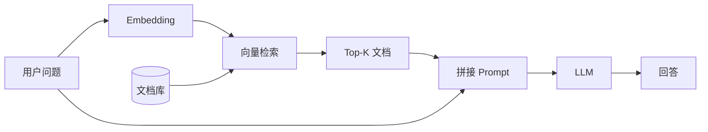

[← 上一章](07-inference.md) | [目录](../README.md) | [下一章 →](09-multimodal.md)

# 第八章：Embedding 模型与 RAG

## 8.1 文本 Embedding

### 8.1.1 是什么

把文本映射到固定维度的稠密向量，语义相似的文本在向量空间中距离近。

```
"The cat sat on the mat"    → [0.12, -0.34, 0.56, ...]  ∈ ℝ^768
"A kitten is on the rug"    → [0.11, -0.32, 0.55, ...]  ← 距离近
"Stock prices rose sharply" → [0.87, 0.23, -0.45, ...]  ← 距离远
```

**用途**: 语义搜索、文档检索、聚类、去重、推荐、RAG

### 8.1.2 训练方法

**Contrastive Learning** (主流):

```python
# InfoNCE Loss (对比学习)
# 正样本对 (query, positive) 要距离近
# 负样本对 (query, negative) 要距离远

def infonce_loss(query, positive, negatives, temperature=0.05):
    pos_sim = cos_sim(query, positive) / temperature
    neg_sims = cos_sim(query, negatives) / temperature
    return -log(exp(pos_sim) / (exp(pos_sim) + sum(exp(neg_sims))))
```

**训练数据构造**:
| 正样本来源 | 方法 |
|-----------|------|
| 标题-正文 | 标题是 query，正文是 positive |
| 问答对 | 问题 → 答案 |
| 翻译对 | 英文 → 中文 |
| NLI | entailment 是正样本 |
| LLM 生成 | 用 GPT-4 生成 synthetic pairs |

**Hard Negatives**: 对比学习的关键。用 BM25 或已有模型检索"看起来相关但不正确"的文档作为负样本。

### 8.1.3 两阶段训练

```
Stage 1: 弱监督预训练
  - 大量标题-正文对、网页锚文本
  - 百万到千万级
  - 学到通用语义

Stage 2: 高质量微调
  - 人工标注的检索相关性数据
  - NLI + STS + 检索数据
  - 几万到几十万
  - 提升特定任务性能
```

### 8.1.4 SOTA Embedding 模型

| 模型 | 维度 | 上下文 | 特点 |
|------|------|--------|------|
| [text-embedding-3-large](https://platform.openai.com/docs/guides/embeddings) (OpenAI) | 3072 | 8K | 商用 SOTA |
| [Voyage-3](https://www.voyageai.com/) | 1024 | 32K | 代码/法律/金融特化 |
| [BGE-M3](https://huggingface.co/BAAI/bge-m3) (BAAI) | 1024 | 8K | 多语言 + 多粒度 |
| [GTE-Qwen2](https://huggingface.co/Alibaba-NLP/gte-Qwen2-7B-instruct) (Alibaba) | 3584 | 128K | 基于 Qwen2 |
| [E5-Mistral-7B](https://arxiv.org/abs/2401.00368) | 4096 | 32K | 基于 Mistral |
| [NV-Embed-v2](https://huggingface.co/nvidia/NV-Embed-v2) (NVIDIA) | 4096 | 32K | [MTEB](https://huggingface.co/spaces/mteb/leaderboard) 排行榜顶 |
| [nomic-embed-text](https://huggingface.co/nomic-ai/nomic-embed-text-v1.5) | 768 | 8K | 开源, 小巧高效 |

> 排行榜: [MTEB (Massive Text Embedding Benchmark)](https://huggingface.co/spaces/mteb/leaderboard)

### 8.1.5 训练自己的 Embedding 模型

```python
# 用 sentence-transformers 微调
from sentence_transformers import SentenceTransformer, InputExample, losses

model = SentenceTransformer("BAAI/bge-base-en-v1.5")

train_examples = [
    InputExample(texts=["query", "positive doc"], label=1.0),
    InputExample(texts=["query", "negative doc"], label=0.0),
]

train_loss = losses.MultipleNegativesRankingLoss(model)
model.fit(
    train_objectives=[(train_dataloader, train_loss)],
    epochs=3,
    warmup_steps=100,
)
```

> 库: [sentence-transformers](https://github.com/UKPLab/sentence-transformers)

## 8.2 向量检索

### 8.2.1 向量数据库

| 数据库 | 类型 | 特点 |
|--------|------|------|
| [FAISS](https://github.com/facebookresearch/faiss) (Meta) | 库 | 最快, GPU 支持, 不是数据库 |
| [Milvus](https://github.com/milvus-io/milvus) | 分布式 | 生产级, 可扩展 |
| [Qdrant](https://github.com/qdrant/qdrant) | 服务 | Rust, 高性能, 过滤好 |
| [Weaviate](https://github.com/weaviate/weaviate) | 服务 | GraphQL API, 多模态 |
| [ChromaDB](https://github.com/chroma-core/chroma) | 嵌入式 | 最简单, 适合原型 |
| [Pinecone](https://www.pinecone.io/) | 托管 | 全托管, 无需运维 |
| [pgvector](https://github.com/pgvector/pgvector) | PostgreSQL 扩展 | 已有 PG 时最方便 |

### 8.2.2 索引类型

```
暴力搜索 (Flat):
  精确, 但 O(n) — 百万级以上不可接受

IVF (Inverted File Index):
  把向量空间分成 K 个聚类, 只搜索最近的几个聚类
  速度: O(n/K), 精度: ~95-99%

HNSW (Hierarchical Navigable Small World):
  构建多层图, 从顶层粗搜到底层精搜
  速度极快, 精度高, 但内存大
  → 最常用的索引类型

PQ (Product Quantization):
  把向量切分成子向量, 各自量化
  大幅压缩内存 (32x-64x), 精度有损
  适合超大规模 (十亿+)

实际选择:
  < 100K 文档: Flat (暴力搜索就行)
  100K - 10M: HNSW
  > 10M: IVF + PQ 或 HNSW + PQ
```

## 8.3 RAG (Retrieval-Augmented Generation)

### 8.3.1 基本流程



```python
# 最简 RAG 实现
import openai
import chromadb

# 1. 文档入库
collection = chroma_client.create_collection("docs")
for doc in documents:
    embedding = openai.embeddings.create(input=doc, model="text-embedding-3-small")
    collection.add(documents=[doc], embeddings=[embedding.data[0].embedding], ids=[doc_id])

# 2. 检索 + 生成
query = "What is the company's return policy?"
results = collection.query(query_texts=[query], n_results=5)

prompt = f"""Answer based on the following context:

{chr(10).join(results['documents'][0])}

Question: {query}"""

response = openai.chat.completions.create(
    model="gpt-4",
    messages=[{"role": "user", "content": prompt}]
)
```

### 8.3.2 RAG 优化技巧

```
问题 → 解决方案:

检索不准:
  → Hybrid Search (向量 + BM25 关键词)
  → Reranker (用 cross-encoder 重排序 top-K)
  → Query Expansion (用 LLM 改写/扩展 query)

文档太长:
  → Chunking 策略: 按段落/句子切分, 保留重叠 (overlap)
  → 递归切分: 先按标题, 再按段落, 最后按句子
  → Small-to-big: 检索小 chunk, 返回大 chunk (包含上下文)

回答不忠实:
  → 引用标注: 让模型标注回答来自哪个文档
  → Faithful prompting: "Only answer based on the provided context"

上下文窗口不够:
  → Map-reduce: 每个文档独立总结, 合并总结
  → 长上下文模型 (Gemini 1.5 2M, Claude 200K)
```

### 8.3.3 高级 RAG 架构

**Reranker (二阶段检索)**:
```
Stage 1: Bi-encoder (快, 检索 top-100)
  query → embedding, doc → embedding, 算 cosine similarity
  
Stage 2: Cross-encoder (慢但准, 从 top-100 选 top-5)
  [query, doc] → 一起输入模型 → relevance score
  
推荐 reranker: 
  - Cohere Rerank
  - bge-reranker-v2-m3
  - jina-reranker-v2-base-multilingual
```

**Agentic RAG**:
```
用户问题 → Agent 判断:
  → 需要检索? → 检索 → 回答
  → 需要计算? → 代码执行 → 回答
  → 需要多步? → 规划 → 多次检索 → 综合回答
  → 直接回答? → 用模型知识
```

### 8.3.4 RAG 框架

| 框架 | 特点 |
|------|------|
| [LangChain](https://github.com/langchain-ai/langchain) | 最流行, 组件多, 但抽象重 |
| [LlamaIndex](https://github.com/run-llama/llama_index) | 专注数据索引和检索 |
| [Haystack](https://github.com/deepset-ai/haystack) | pipeline 设计, 生产友好 |
| 自己写 | 推荐。RAG 核心逻辑很简单 (embed → search → prompt) |

### 8.3.5 RAG vs Fine-Tuning vs Long Context

| 方法 | 适用场景 | 优势 | 劣势 |
|------|---------|------|------|
| **RAG** | 知识库会更新、需要引用来源 | 数据可实时更新, 可审计 | 检索质量是瓶颈 |
| **Fine-Tuning** | 改变模型行为/风格/格式 | 不需要运行时检索 | 知识不好更新 |
| **Long Context** | 几十个文档的问答 | 最简单，不需要检索 | 成本高, 有上限 |

**实际建议**: 三者经常组合使用。Fine-tune 让模型学会格式和风格，RAG 提供实时知识，长上下文处理少量关键文档。

## 关键论文

- [Devlin et al. (2018) — BERT](https://arxiv.org/abs/1810.04805) — encoder 范式与 [CLS] 表征
- [Reimers & Gurevych (2019) — Sentence-BERT](https://arxiv.org/abs/1908.10084) — 双塔检索的标准做法
- [Karpukhin et al. (2020) — DPR](https://arxiv.org/abs/2004.04906) — Dense Passage Retrieval
- [Khattab & Zaharia (2020) — ColBERT](https://arxiv.org/abs/2004.12832) — late interaction，token 级匹配
- [Lewis et al. (2020) — RAG](https://arxiv.org/abs/2005.11401) — 检索增强生成原始论文

## 进一步阅读

- [BGE Embedding 系列](https://github.com/FlagOpen/FlagEmbedding)：开源 embedding SOTA
- [LangChain](https://github.com/langchain-ai/langchain) / [LlamaIndex](https://github.com/run-llama/llama_index)：RAG 编排框架
- [Chroma](https://www.trychroma.com/) / [Qdrant](https://qdrant.tech/) / [Milvus](https://milvus.io/)：向量数据库选型

## 练习题

1. **MTEB 评测**：用 BGE-large-zh 和 OpenAI text-embedding-3-large 在你的私有语料上对比 retrieval@5。
2. **Chunking 实验**：固定模型，对比 256/512/1024 token chunk 与 overlap 0/64/128 对答题准确率的影响。
3. **Hybrid Search**：实现 BM25 + dense 加权融合，调权重，看比纯 dense 提升多少。

---

[← 上一章](07-inference.md) | [目录](../README.md) | [下一章 →](09-multimodal.md)
