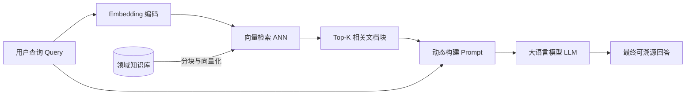

[← 上一章](07-inference.md) | [目录](../README.md) | [下一章 →](09-multimodal.md)

# 第八章：Embedding 模型与 RAG

如果说大语言模型是通晓规律与具备推理能力的“大脑”，那么 Embedding 模型与检索增强生成（Retrieval-Augmented Generation, RAG）则是其连接外部动态世界、消解幻觉与拓展长期记忆的核心系统。通过将离散的符号序列映射至高维连续几何空间，模型得以在语义流形上进行相似度度量与拓扑检索，从而为大模型提供精准的事实验证与知识支撑。

## 8.1 文本 Embedding 与语义表征

### 8.1.1 语义几何化

文本 Embedding 的核心使命是将变长自然语言映射为固定维度的稠密连续向量（Dense Vector $\mathbf{e} \in \mathbb{R}^d$）。在这一向量空间中，语义亲疏被转化为几何距离（如余弦相似度或欧氏距离）。

```
"The cat sat on the mat"    → [ 0.12, -0.34,  0.56, ...] ∈ ℝ^768
"A kitten is on the rug"    → [ 0.11, -0.32,  0.55, ...] (余弦相似度高，向量夹角小)
"Stock prices rose sharply" → [ 0.87,  0.23, -0.45, ...] (余弦相似度低，语义正交)
```

**工业应用图景**: 语义搜索、海量文档召回、多模态图文匹配、知识聚类、用户意图分类以及 RAG 检索上下文对齐。

### 8.1.2 对比学习与目标函数

现代高质量 Embedding 模型普遍基于双塔结构（Bi-Encoder / Dual-Encoder），采用对比学习（Contrastive Learning）机制驱动训练。其数学本质是最大化正样本对之间的互信息下界（InfoNCE Loss）。

```python
# InfoNCE 对比损失函数
# 优化目标: 在超球面上拉近正样本对 (query, positive)，同时推远所有负样本 (query, negative)

def infonce_loss(query, positive, negatives, temperature=0.05):
    pos_sim = cos_sim(query, positive) / temperature
    neg_sims = cos_sim(query, negatives) / temperature
    return -log(exp(pos_sim) / (exp(pos_sim) + sum(exp(neg_sims))))
```

**多源对比数据构造**:
| 正样本源 | 构造方式 | 监督信号类型 |
|---------|---------|-------------|
| 标题与正文 | 文档标题作为 Query，正文段落作为 Positive | 弱监督自然语料 |
| 问答对 (QA) | 用户真实问题映射至标准解答段落 | 强监督检索对齐 |
| 跨语言翻译对 | 源语言句子映射至目标语言平行句 | 跨语言多语言对齐 |
| 自然语言推理 (NLI) | 前提句与蕴含句（Entailment）构造正样本 | 严格逻辑语义对齐 |
| 合成数据蒸馏 | 利用前沿大模型针对特定长尾领域合成高质量 (Query, Passage) 对 | 领域泛化特化增强 |

**难负样本挖掘（Hard Negatives Mining）**: 
对比学习的表征质量高度依赖于负样本的区分难度。除 Batch 内随机负样本（In-batch Negatives）外，必须引入“字面重合度高但语义无关”的难负样本（利用 BM25 检索高分无关文档或交叉模型预测伪正例），强迫编码器学习深层语义而非浅层关键词匹配。

### 8.1.3 多阶段训练范式

工业级通用 Embedding 模型的训练通常遵循渐进式多阶段演进路线：

```
第一阶段: 弱监督大规模预训练 (Unsupervised / Weakly Supervised Pretraining)
  - 语料规模: 数亿至数十亿网页锚文本、标题段落对、跨语言对
  - 核心目标: 在超大批大小（Large Batch Size）下构建基础语义超球面流形

第二阶段: 多任务对比微调 (Multi-Task Fine-Tuning)
  - 语料规模: 数十万至数百万高质量人工精标检索对、问答对与分类推理数据
  - 核心目标: 注入任务前缀指令（Task Instruction），区分聚类、检索与对称匹配能力

第三阶段: 难样本重采样与蒸馏 (Hard Negative SFT & Distillation)
  - 结合 Cross-Encoder 教师模型对海量候选进行精细重评分，进行知识蒸馏与边缘强化
```

### 8.1.4 SOTA Embedding 体系与 MRL 特性

现代主流向量模型大多支持俄罗斯套娃表征学习（Matryoshka Representation Learning, MRL），允许用户在推理时仅截取前 $d'$ 维（如从 3072 维截断至 512 维）即可保留 98% 以上的检索精度，极大节约向量存储与检索开销。

| 模型 | 输出维度 | 上下文窗口 | 核心特性与架构优势 |
|------|---------|-----------|-------------------|
| [text-embedding-3-large](https://platform.openai.com/docs/guides/embeddings) | 3072 (支持 MRL) | 8K | 商用 API 标杆，支持多尺度弹性降维 |
| [Voyage-3](https://www.voyageai.com/) | 1024 | 32K | 针对编程代码、金融与法律领域深度特化 |
| [BGE-M3](https://huggingface.co/BAAI/bge-m3) | 1024 | 8K | 集稠密向量、稀疏权重与多向量交互于一体 |
| [GTE-Qwen2](https://huggingface.co/Alibaba-NLP/gte-Qwen2-7B-instruct) | 3584 | 128K | 基于 Qwen2 架构，具备极强长程理解与指令遵循能力 |
| [E5-Mistral-7B](https://arxiv.org/abs/2401.00368) | 4096 | 32K | 基于自回归 LLM 激活状态投影构建的大尺寸向量模型 |
| [NV-Embed-v2](https://huggingface.co/nvidia/NV-Embed-v2) | 4096 | 32K | 融合潜在注意力池化（Latent Attention Pooling）的榜首模型 |
| [nomic-embed-text](https://huggingface.co/nomic-ai/nomic-embed-text-v1.5) | 768 (支持 MRL) | 8K | 完全开源可复现，轻量端侧友好 |

> 全球评测基准参考: [MTEB (Massive Text Embedding Benchmark)](https://huggingface.co/spaces/mteb/leaderboard)

### 8.1.5 微调实战代码

```python
# 基于 sentence-transformers 进行领域对比微调
from sentence_transformers import SentenceTransformer, InputExample, losses
from torch.utils.data import DataLoader

# 加载开源预训练基座
model = SentenceTransformer("BAAI/bge-base-en-v1.5")

# 构造对比样本 (Query, Positive, Negative)
train_examples = [
    InputExample(texts=["What is KV Cache?", "KV Cache stores past key-value states to speed up autoregressive decoding."]),
    InputExample(texts=["What is LoRA?", "Low-Rank Adaptation freezes base weights and updates low-rank matrices."]),
]

train_dataloader = DataLoader(train_examples, shuffle=True, batch_size=16)

# 采用带负样本排名的多负样本损失 (MultipleNegativesRankingLoss)
train_loss = losses.MultipleNegativesRankingLoss(model)

model.fit(
    train_objectives=[(train_dataloader, train_loss)],
    epochs=3,
    warmup_steps=100,
    show_progress_bar=True
)
```

## 8.2 向量检索与近似最近邻 (ANN)

在大规模数据集中，全量暴力计算向量余弦相似度的复杂度为 $O(N \cdot d)$，在千万级数据规模下延迟不可承受。近似最近邻检索（Approximate Nearest Neighbor, ANN）通过在空间划分、图拓扑或量化编码上做权衡，换取毫秒级亚线性查询。

### 8.2.1 向量存储系统矩阵

| 数据库 | 架构类型 | 核心技术特色 | 典型适用场景 |
|--------|---------|-------------|-------------|
| [FAISS](https://github.com/facebookresearch/faiss) (Meta) | 纯 C++ 算法底座 | GPU/CPU 极致性能加速，无原生分布式与网络服务 | 嵌入式高性能计算核心 |
| [Milvus](https://github.com/milvus-io/milvus) | 存储计算分离分布式 | 原生云原生设计，支撑百亿级数据弹性扩展 | 大型企业级基础设施 |
| [Qdrant](https://github.com/qdrant/qdrant) | Rust 原生单机/集群 | 极为强大的标量条件联合过滤（Payload Filter） | 生产级高并发搜索系统 |
| [Weaviate](https://github.com/weaviate/weaviate) | 模块化向量图数据库 | 原生支持 GraphQL、混合搜索与多模态扩展 | 快速构建 AI 检索应用 |
| [ChromaDB](https://github.com/chroma-core/chroma) | 嵌入式开发数据库 | 极简 Python API，开箱即用，零配置运维 | 本地原型验证与轻量 Agent |
| [Pinecone](https://www.pinecone.io/) | 全托管 Serverless | 免运维，按调用与存储用量计费 | 快速上线、无运维团队 |
| [pgvector](https://github.com/pgvector/pgvector) | PostgreSQL 原生插件 | 统一管理业务关系型数据与向量表，支持事务与 ACID | 已有 PG 架构的技术栈演进 |

### 8.2.2 索引结构与时空权衡

```
1. 暴力全检索 (Flat Index):
   精确计算所有点积，准确率 100%，但时间复杂度 O(N)。仅适合 N < 100K 规模。

2. 倒排文件索引 (IVF, Inverted File Index):
   利用 K-Means 将高维空间划分为 K 个 Voronoi 空间胞元。查询时仅遍历最近的若干个质心胞元。
   复杂度降至 O(N / K)，召回率可达 95% - 99%。

3. 分层可导航小世界图 (HNSW, Hierarchical Navigable Small World):
   构建多层图拓扑，顶层跨度大进行远距离快速跳跃，底层精细化局部贪心搜索。
   查询延迟为 O(log N)，召回率极高（>98%），但构建与内存开销显著。
   → 现代工业生产中召回率与延迟综合表现最优的选择。

4. 乘积量化 (PQ, Product Quantization):
   将高维向量切分为 m 个子空间，每个子空间训练码本（Codebook），将向量压缩为极短的码本索引（如 1/32 大小）。
   借助不对称距离查表（ADC）实现超高吞吐，适合十亿级以上超大规模低成本存储。
```

## 8.3 检索增强生成 (RAG)

### 8.3.1 核心范式与基本流程

RAG 打破了传统大模型将知识完全固化于模型权重的范式，建立了“外部索引检索 + 动态上下文注入”的双轮驱动机制。



```python
# 极简端到端 RAG 实现示例
import openai
import chromadb

chroma_client = chromadb.Client()
collection = chroma_client.create_collection("enterprise_docs")

# 1. 知识分块入库
documents = [
    "Company refund policy: Full refund within 30 days of purchase upon proof of receipt.",
    "Shipping guidelines: Standard shipping takes 3-5 business days across continental regions."
]
for idx, doc in enumerate(documents):
    emb = openai.embeddings.create(input=doc, model="text-embedding-3-small").data[0].embedding
    collection.add(documents=[doc], embeddings=[emb], ids=[f"doc_{idx}"])

# 2. 查询、检索与生成
query = "Can I get a refund after 20 days?"
query_emb = openai.embeddings.create(input=query, model="text-embedding-3-small").data[0].embedding
retrieved = collection.query(query_embeddings=[query_emb], n_results=1)

context = "\n".join(retrieved["documents"][0])
prompt = f"Context:\n{context}\n\nQuestion: {query}\nAnswer based strictly on context:"

response = openai.chat.completions.create(
    model="gpt-4",
    messages=[{"role": "user", "content": prompt}]
)
```

### 8.3.2 工业级 RAG 关键优化工程

实战场景中，朴素 RAG 常常面临“检索不准”、“切分碎片化”和“模型幻觉”三大痛点。以下为核心解法：

```
一、检索召回精度优化:
  - 混合检索 (Hybrid Search): 结合 BM25 关键词精确匹配（捕获型号、专有名词）与 Dense 向量检索（捕获语义相关），利用倒数秩融合（RRF, Reciprocal Rank Fusion）平衡得分。
  - 二阶段重排 (Cross-Encoder Reranker): 使用全注意力交互的重排模型对 Top-50/100 粗筛结果进行精细打分，截取 Top-5。
  - 查询重写与假想文档生成 (HyDE): 利用 LLM 将模糊问题扩写为完整解答雏形，再以假想文档的向量去检索真实相似文献。

二、文档切分与上下文结构化 (Chunking Strategies):
  - 语义切分 (Semantic Chunking): 基于句子间的向量余弦跳变点进行切分，而非固定字符粗暴截断。
  - 父子块架构 (Small-to-Big / Parent-Child Chunking): 检索阶段匹配精细细粒度的小 Chunk（50-100 tokens），输入 LLM 上下文时扩展替换为其所属的父文档块（500-1000 tokens）。
  - 滑动窗口重叠 (Sliding Window with Overlap): 保持 10%-20% 的上下文重叠以避免断裂实体。

三、忠实度与长程上下文控制:
  - 引用溯源 (Citations): 约束 Prompt 要求模型回答时强制标注文献段落序号。
  - 否定拒绝防护: 当检索得分普遍低于阈值时，明确指令模型返回“参考资料不足”，避免盲目幻觉。
```

### 8.3.3 高级架构: 重排器与 Agentic RAG

**二阶段检索流水线 (Two-Stage Pipeline)**:
```
阶段一: Bi-Encoder (快速粗召回 Top-100)
  Query 向量与 Document 向量独立编码，毫秒级点积扫描。
  
阶段二: Cross-Encoder (深度精排 Top-5)
  将 [Query; Document] 作为一个完整拼接序列直接送入 Transformer，
  在全层进行全注意力交叉交互，捕获精微逻辑关联。
  
工业级推荐 Reranker: 
  - BAAI/bge-reranker-v2-m3
  - Cohere Rerank-v3
  - jina-reranker-v2-base-multilingual
```

**Agentic RAG（自主决策检索代理）**:
传统 RAG 是单向静态管道，而 Agentic RAG 赋予模型动态路由与反思能力：
1. **意图路由**: 自主判断问题属于需要外部检索的事实、内部推理代码、还是模型已有先验。
2. **多跳迭代检索 (Multi-Hop Retrieval)**: 针对复杂问题分解为子任务，多轮检索并在中间结果上合成最终答案。
3. **检索自我反思 (Self-RAG / Corrective RAG)**: 生成后自主评估上下文相关性与事实支持度，若不符合则触发重新检索或自校正。

### 8.3.4 技术选型决策树: RAG vs 微调 vs 长上下文

| 评估维度 | 检索增强 (RAG) | 参数微调 (Fine-Tuning) | 超长上下文 (Long Context) |
|---------|---------------|----------------------|-------------------------|
| **核心适用领域** | 动态知识库更新、私有事实、需严格引用溯源 | 风格迁移、格式约束、特定领域推理逻辑 | 单次包含数本书籍、代码库整体阅读 |
| **知识时效性** | 毫秒级写入生效（向量库实时增删） | 静态固化（需重训或增量微调） | 运行时即时加载 |
| **数据安全性与权限** | 可通过向量库元数据做行级权限隔离 | 无法做权限隔离（知识混合于权重） | 基于 Prompt 会话级隔离 |
| **显存与推理成本** | 推理成本低（仅携带 Top-K 块） | 推理成本最低（无额外 Prompt） | 推理成本高（长序列 Prefill 与 KV 占用大） |
| **幻觉抑制效果** | 极佳（可结合上下文严格验证） | 较弱（无法根本杜绝参数幻觉） | 较好（受“Lost in the Middle”影响） |

**工业最佳实践**: 采用混合技术栈。利用 Fine-Tuning 将模型训练出领域专有输出风格与严谨的工具调用能力；利用 RAG 管理千万级动态知识与审计链条；在局部复杂场景借助 Long Context 注入关键完整上下文。

## 关键论文

- [Devlin et al. (2018): BERT: Pre-training of Deep Bidirectional Transformers for Language Understanding](https://arxiv.org/abs/1810.04805)：双向编码器架构与句向量表征基础。
- [Reimers & Gurevych (2019): Sentence-BERT: Sentence Embeddings using Siamese BERT-Networks](https://arxiv.org/abs/1908.10084)：孪生双塔网络句向量对比学习标准范式。
- [Karpukhin et al. (2020): Dense Passage Retrieval for Open-Domain Question Answering (DPR)](https://arxiv.org/abs/2004.04906)：稠密段落检索奠基之作。
- [Khattab & Zaharia (2020): ColBERT: Efficient and Effective Passage Search via Contextualized Late Interaction](https://arxiv.org/abs/2004.12832)：后交互 Token 级细粒度匹配架构。
- [Lewis et al. (2020): Retrieval-Augmented Generation for Knowledge-Intensive NLP Tasks](https://arxiv.org/abs/2005.11401)：RAG 范式原始开创性论文。

## 进阶参考

- [FlagEmbedding (BGE 系列)](https://github.com/FlagOpen/FlagEmbedding)：当前业界领先的开源全栈 Embedding 与 Reranker 生态。
- [LlamaIndex](https://github.com/run-llama/llama_index) / [LangChain](https://github.com/langchain-ai/langchain)：企业级数据索引、知识编排与 RAG 框架。
- [Milvus](https://milvus.io/) / [Qdrant](https://qdrant.tech/)：生产级分布式向量检索系统架构指南。

## 练习题

1. **MTEB 定制评测**: 选取 BGE-large-zh 与 text-embedding-3-large，在特定垂直业务语料上评测 Hit@1、Hit@5 与 MRR@10 指标，分析二者在专有名词上的表征差异。
2. **切分策略消融实验**: 固定模型与测试集，对比固定分块（256/512/1024 tokens）、滑动重叠（Overlap 0/64/128）与 Parent-Child 父子块切分对最终问答准确率与上下文完整度的影响。
3. **混合检索系统搭建**: 结合 ElasticSearch/BM25 与 Qdrant 稠密向量检索，实现基于 RRF（Reciprocal Rank Fusion）的加权融合检索器，评测其相比单路稠密检索的抗噪能力提升。

---

[← 上一章](07-inference.md) | [目录](../README.md) | [下一章 →](09-multimodal.md)
