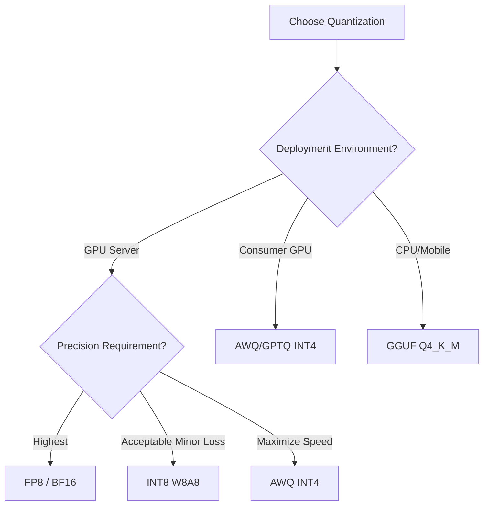

[← Previous Chapter](06-infra.md) | [Table of Contents](README.md) | [Next Chapter →](08-embedding-rag.md)

# Chapter 7: Inference and Deployment

## 7.1 KV Cache

```
During autoregressive generation, each new token needs attention over all preceding tokens
Naive: Recompute all K, V every time → O(n²) per token

KV Cache: Cache historical K, V; only compute K, V for the new token
→ O(n) per token
→ But the cache uses memory: 2 * layers * kv_heads * head_dim * seq_len * bytes

70B model, 128K context, BF16:
KV cache ≈ 2 * 80 * 8 * 128 * 128K * 2 ≈ 42GB per request!
```

**KV Cache optimizations**:
- **GQA**: Fewer KV heads → smaller cache ([see Chapter 2](02-architecture.md#231-gqa-grouped-query-attention))
- **MLA**: Compress into a latent → much smaller cache ([see Chapter 2](02-architecture.md#233-mla-multi-head-latent-attention))
- **PagedAttention** ([vLLM](https://github.com/vllm-project/vllm)): Virtual memory paging for KV cache, eliminating fragmentation
- **KV Cache Quantization**: Quantize KV cache to INT8/FP8

## 7.2 Quantized Inference

| Method | Precision | Speedup | Quality Loss |
|------|------|---------|---------|
| BF16 | 16-bit | 1x (baseline) | None |
| INT8 (W8A8) | 8-bit | ~2x | Negligible |
| FP8 | 8-bit | ~2x | Negligible |
| INT4 ([GPTQ](https://arxiv.org/abs/2210.17323)/[AWQ](https://arxiv.org/abs/2306.00978)) | 4-bit | ~3-4x | Small |
| GGUF Q4_K_M | 4-bit mixed | ~3-4x | Small |
| INT2-3 | 2-3 bit | ~5x+ | Noticeable |

**GPTQ**: Post-training quantization using calibration data to minimize quantization error
**AWQ**: Activation-aware Weight Quantization, protects salient weights
**GGUF**: [llama.cpp](https://github.com/ggerganov/llama.cpp) format, hybrid CPU/GPU inference

### How to Choose a Quantization Method



## 7.3 Inference Frameworks

| Framework | Features | Best For |
|------|------|------|
| [**vLLM**](https://github.com/vllm-project/vllm) | PagedAttention, continuous batching | Go-to for production deployment |
| [**TensorRT-LLM**](https://github.com/NVIDIA/TensorRT-LLM) | NVIDIA-optimized, FP8 | Maximum throughput |
| [**SGLang**](https://github.com/sgl-project/sglang) | RadixAttention, prefix caching | Complex prompts / agents |
| [**llama.cpp**](https://github.com/ggerganov/llama.cpp) | CPU/Apple Silicon, GGUF | Local inference |
| [**MLC-LLM**](https://github.com/mlc-ai/mlc-llm) | Compiler optimizations, multi-platform | On-device |
| [**Ollama**](https://ollama.com/) | Wraps llama.cpp, one-click deploy | Personal use |

### Quick Deployment with vLLM

```bash
# Install
pip install vllm

# Start an OpenAI-compatible API server
vllm serve meta-llama/Llama-3-8B-Instruct \
    --dtype bfloat16 \
    --max-model-len 8192 \
    --gpu-memory-utilization 0.9

# Usage (fully compatible with the OpenAI API)
curl http://localhost:8000/v1/chat/completions \
    -H "Content-Type: application/json" \
    -d '{"model": "meta-llama/Llama-3-8B-Instruct", "messages": [{"role": "user", "content": "Hello"}]}'
```

### Key Concept: Continuous Batching

```
Traditional Static Batching:
  Request A (100 tokens) ─────────────────────────▶ done
  Request B (30 tokens)  ──────────▶ done [waiting for A...]
  Request C (50 tokens)  ────────────────▶ done [waiting for A...]
  → B and C waste significant GPU time waiting for A

Continuous Batching (vLLM, TRT-LLM):
  Request A ─────────────────────────▶ done
  Request B ──────────▶ done → Request D ─────▶ done
  Request C ────────────────▶ done → Request E ──▶
  → New requests are inserted as soon as B finishes, maximizing GPU utilization
```

## 7.4 Speculative Decoding

([Leviathan et al., 2023](https://arxiv.org/abs/2211.17192))

```
Problem: Autoregressive LLM generation is memory-bound, GPU compute utilization is low

Solution: Use a small model (draft) to quickly generate K tokens, then verify in parallel with the large model (target)

Draft model: quickly generates t1, t2, t3, t4, t5  (5 tokens)
Target model: verifies in parallel → accepts t1, t2, t3, rejects t4 → regenerates from t3 onward

Result: The large model verifies K tokens in a single forward pass, outputting ~K/2 tokens
       2-3x speedup, output quality identical to the large model alone
```

**[EAGLE](https://arxiv.org/abs/2401.15077)** (advanced speculative decoding):
- Draft model uses intermediate-layer features from the target model
- More accurate than an independent draft model
- 3x+ speedup

## 7.5 Structured Output (Structured Generation)

### 7.5.1 JSON Mode

Force the model to output valid JSON, for use in function calling, data extraction, etc.

**Method 1: Constrained Decoding** (enforced at inference time)
```python
# vLLM / SGLang support JSON schema constraints
from pydantic import BaseModel

class WeatherQuery(BaseModel):
    city: str
    unit: str = "celsius"

# Model is forced to output only JSON conforming to the schema
response = client.chat.completions.create(
    model="llama-3-8b-instruct",
    messages=[{"role": "user", "content": "What's the weather in Stockholm?"}],
    response_format={
        "type": "json_schema",
        "json_schema": WeatherQuery.model_json_schema()
    }
)
```

**Method 2: Guided Generation** ([Outlines](https://github.com/dottxt-ai/outlines))
```python
import outlines

model = outlines.models.transformers("meta-llama/Llama-3-8B-Instruct")
generator = outlines.generate.json(model, WeatherQuery)
result = generator("What's the weather in Stockholm?")
# WeatherQuery(city='Stockholm', unit='celsius') — guaranteed valid
```

**Method 3: Regex/Grammar Constraints**
- [Outlines](https://github.com/dottxt-ai/outlines): Regular expressions, JSON schema, CFG
- [LMQL](https://github.com/eth-sri/lmql): SQL-like LLM query language
- [Guidance](https://github.com/guidance-ai/guidance): Template-based generation

### 7.5.2 Function Calling

```python
tools = [{
    "type": "function",
    "function": {
        "name": "get_weather",
        "description": "Get current weather",
        "parameters": {
            "type": "object",
            "properties": {
                "city": {"type": "string"},
                "unit": {"type": "string", "enum": ["celsius", "fahrenheit"]}
            },
            "required": ["city"]
        }
    }
}]

response = client.chat.completions.create(
    model="gpt-4",
    messages=[{"role": "user", "content": "Weather in Stockholm?"}],
    tools=tools,
)
# → {"name": "get_weather", "arguments": {"city": "Stockholm", "unit": "celsius"}}
```

## 7.6 Cost Estimation

### 7.6.1 Training Cost Formula

```
Training cost ≈ 6 × N × D / (GPU_FLOPS × MFU × n_GPUs × 3600) × $/GPU-hour

N = Number of parameters
D = Number of tokens
GPU_FLOPS = GPU BF16 compute (e.g., H100 = 989 TFLOPS)
MFU = Actual utilization (0.3-0.5)
$/GPU-hour = Cloud GPU rental price

Example: 7B model, 1T tokens, 8x H100:
= 6 × 7e9 × 1e12 / (989e12 × 0.4 × 8 × 3600)
= 4.2e22 / 1.14e19
= ~3700 hours ≈ 154 days (single GPU)
= ~19 days (8 GPUs)
Cost: 19 days × 24h × 8 GPUs × $3.5/GPU-hour ≈ $12,768
```

### 7.6.2 GPU Cloud Pricing Reference (2025/2026)

| GPU | On-Demand | Reserved | Platform |
|-----|---------|---------|------|
| A100 80GB | ~$2.0/hr | ~$1.2/hr | Lambda, RunPod |
| H100 SXM | ~$3.5/hr | ~$2.0/hr | Lambda, AWS p5 |
| H200 | ~$4.5/hr | ~$2.8/hr | CoreWeave |
| RTX 4090 | ~$0.5/hr | ~$0.3/hr | vast.ai, RunPod |

> Prices change constantly; check current rates. Long-term contracts are typically 40-60% cheaper.

### 7.6.3 Inference Cost

```
Key inference cost metrics:
- $/1M tokens (input)
- $/1M tokens (output)
- Tokens/second (throughput)
- Time-to-first-token (latency)

Cost reduction strategies:
1. Quantization (INT4/FP8): Serve 2-4x more requests on the same GPU
2. Prefix caching: Compute shared system prompts only once
3. Batching: Continuous batching improves throughput
4. Smaller models: Use 8B instead of 70B for simple tasks
5. Speculative decoding: Reduce the number of large-model forward passes
```

[← Previous Chapter](06-infra.md) | [Table of Contents](README.md) | [Next Chapter →](08-embedding-rag.md)
