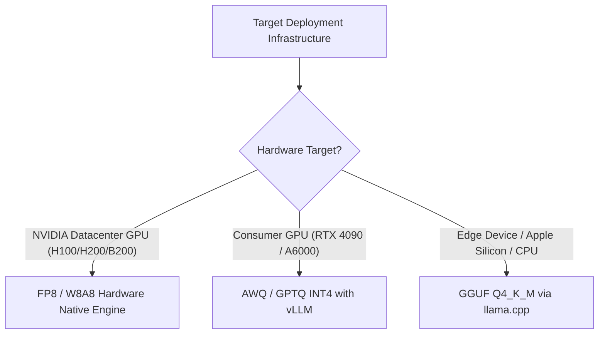

[← Previous Chapter](06-infra.md) | [Table of Contents](README.md) | [Next Chapter →](08-embedding-rag.md)

# Chapter 7: Inference and Serving Systems

While model training is compute-bound, autoregressive LLM decoding during inference is fundamentally memory-bandwidth bound. Maximizing serving throughput and minimizing time-to-first-token (TTFT) requires specialized memory virtualization, continuous batch scheduling, and low-precision quantization.

## 7.1 Key-Value Cache (KV Cache) Dynamics

Autoregressive token generation generates one token per step conditioned on all preceding keys and values.

```
Algorithmic Complexity Transition:
Naive Autoregressive Generation:
  Recomputes Key and Value projections for all context tokens on every single step.
  Computational Complexity: O(N^2) per generated token.

KV Cache State Retention:
  Caches historical Key and Value tensors in GPU memory; computes projections strictly for the newly appended token.
  Computational Complexity: O(N) per generated token.
  
KV Cache Memory Footprint Formulation:
Memory_bytes = 2 × L_layers × H_kv_heads × D_head × T_seq_len × Bytes_per_element

Concrete Resource Scale:
For a 70B parameter model (80 layers, 8 GQA heads, head dimension 128) at 128K context in BF16:
KV Cache ≈ 2 × 80 × 8 × 128 × 131,072 × 2 bytes ≈ 43.0 GB per concurrent request!
```

**Memory Optimization Paradigms**:
- **Architectural Pruning**: Grouped-Query Attention (GQA) and Multi-Head Latent Attention (MLA) compress KV head counts and dimensions directly at the model definition level.
- **PagedAttention** ([Kwon et al., 2023](https://arxiv.org/abs/2309.06180)): Replaces contiguous virtual memory allocation with OS-style non-contiguous block paging, driving internal memory fragmentation down from >60% to <4%.
- **Low-Precision KV Quantization**: Quantizes cached Key and Value vectors into FP8 or INT8 formats, halving KV cache capacity overhead with negligible degradation in generation fidelity.

## 7.2 Post-Training Quantization (PTQ)

| Precision Format | Weight Bitwidth | Activation Bitwidth | Throughput Multiplier | Downstream Accuracy Retention |
|------------------|-----------------|---------------------|-----------------------|-------------------------------|
| BF16 / FP16 | 16 | 16 | 1.0x (Baseline) | Lossless ground truth |
| FP8 (E4M3 / E5M2) | 8 | 8 | ~1.8x–2.2x | >99.5% accuracy retention |
| INT8 (W8A8) | 8 | 8 | ~1.8x–2.0x | >99.0% accuracy retention |
| INT4 (AWQ / GPTQ) | 4 | 16 | ~2.5x–3.5x | Minor degradation on complex reasoning |
| GGUF (k-quants) | 4-bit mixed | 16 | ~2.5x–3.5x | Tailored for edge/CPU inference |
| INT2 / INT3 | 2–3 | 16 | ~4.5x+ | Substantial perplexity penalty |

**Algorithmic Quantization Approaches**:
- **GPTQ** ([Frantar et al., 2022](https://arxiv.org/abs/2210.17323)): One-shot layer-wise second-order weight quantization using approximate Hessian inverses to compensate for quantization noise.
- **AWQ (Activation-Aware Weight Quantization)** ([Lin et al., 2023](https://arxiv.org/abs/2306.00978)): Observes that preserving the top 1% most salient weight channels (identified by large activation magnitudes) protects model capability without quantizing entire matrices uniformly.
- **GGUF Format**: The binary runtime container of [llama.cpp](https://github.com/ggerganov/llama.cpp), supporting flexible mixed quantization schemes across CPU, Metal, and CUDA backends.

### Production Quantization Decision Flow



## 7.3 High-Throughput Serving Frameworks

| Serving Engine | Primary Architecture Innovations | Optimized Use Cases |
|----------------|---------------------------------|---------------------|
| [**vLLM**](https://github.com/vllm-project/vllm) | PagedAttention, continuous batching, chunked prefill | Production microservice deployments |
| [**TensorRT-LLM**](https://github.com/NVIDIA/TensorRT-LLM) | Deep NVIDIA kernel fusion, in-flight batching, FP8 | Enterprise GPU clusters maximizing token throughput |
| [**SGLang**](https://github.com/sgl-project/sglang) | RadixAttention (prefix tree sharing), structured runtime | Multi-turn chat, agents, structured JSON parsing |
| [**llama.cpp**](https://github.com/ggerganov/llama.cpp) | Zero external dependencies, pure C/C++, GGUF | On-premise CPU, edge hardware, Apple Silicon |
| [**MLC-LLM**](https://github.com/mlc-ai/mlc-llm) | Apache TVM compilation, multi-backend acceleration | Cross-platform embedded devices and web runtimes |

### Quick Deployment with vLLM

```bash
# Launch production OpenAI-compatible serving engine
vllm serve meta-llama/Meta-Llama-3-8B-Instruct \
    --dtype bfloat16 \
    --max-model-len 8192 \
    --gpu-memory-utilization 0.90 \
    --enable-chunked-prefill

# Client invocation via standard OpenAI API schema
curl http://localhost:8000/v1/chat/completions \
    -H "Content-Type: application/json" \
    -d '{
        "model": "meta-llama/Meta-Llama-3-8B-Instruct",
        "messages": [{"role": "user", "content": "Explain KV cache paging."}]
    }'
```

### Continuous Batching and Chunked Prefill

```
Static Batching (Coarse-Grained Scheduling):
  Request 1 (120 tokens) ─────────────────────────────────▶ Completed
  Request 2 (25 tokens)  ────────▶ Completed [GPU idles waiting for Request 1...]
  Request 3 (60 tokens)  ───────────────────▶ Completed [GPU idles waiting for Request 1...]
  Bottleneck: Execution latency is bounded strictly by the longest request in the batch.

Continuous Iteration-Level Batching (vLLM / SGLang):
  Request 1 ─────────────────────────────────▶ Completed
  Request 2 ────────▶ Completed ──> Inject Request 4 ──────────▶ Completed
  Request 3 ───────────────────▶ Completed ──> Inject Request 5 ──▶
  Result: Iteration-level scheduling evicts finished sequences and inserts new requests dynamically on every step.
```

## 7.4 Speculative Decoding

([Leviathan et al., 2023](https://arxiv.org/abs/2211.17192))

**The Bandwidth Latency Dilemma**: In memory-bound generation, loading billions of parameters into registers to compute a single token underutilizes arithmetic compute cores.

**The Solution**: A compact draft model proposes a speculative sequence of $K$ candidate tokens at high speed; the large target foundation model verifies all $K$ tokens concurrently in a single parallel forward pass:

```
Draft Model (Fast Rollout):
  Autoregressively emits candidates: [t_1, t_2, t_3, t_4, t_5]

Target Model (Single Parallel Verification Pass):
  Evaluates conditional likelihoods P(t_i | t_<i) across all 5 positions in parallel.
  Verification Decision: Accepts [t_1, t_2, t_3], Rejects t_4, Emits corrected token t_4'.
  
Mathematical Guarantee: The accepted token distribution identically matches the exact output distribution of the target model alone (lossless acceleration).
Empirical Speedup: 2.0x to 3.0x lower wall-clock latency.
```

**EAGLE & Medusa Speculative Paradigms**:
- **Medusa** ([Cai et al., 2024](https://arxiv.org/abs/2401.10774)): Attaches multiple parallel prediction heads to the target model backbone, predicting multiple future positions without a separate draft network.
- **EAGLE** ([Li et al., 2024](https://arxiv.org/abs/2401.15077)): Feeds target model intermediate hidden states to a lightweight single-layer draft head, achieving higher acceptance lengths across diverse benchmarks.

## 7.5 Structured Generation & Constrained Decoding

### 7.5.1 Schema-Constrained Decoding

Guarantees that generated outputs strictly conform to predefined schemas (JSON, SQL, Pydantic classes) without prompting retries.

**Grammar-Guided Logit Masking** ([Outlines](https://github.com/dottxt-ai/outlines)):
- Converts JSON schemas or regular expressions into a Deterministic Finite Automaton (DFA) or Context-Free Grammar (CFG).
- At each step $t$, masks invalid token logits to $-\infty$ prior to softmax, ensuring only syntactically legal tokens can be sampled.

```python
import outlines
from pydantic import BaseModel, Field

class ClusterTelemetry(BaseModel):
    node_id: str
    active_gpus: int = Field(ge=0, le=8)
    gpu_temperature_celsius: float

model = outlines.models.transformers("meta-llama/Meta-Llama-3-8B-Instruct")
generator = outlines.generate.json(model, ClusterTelemetry)
result = generator("Report telemetry status for node worker-042.")
# Returns guaranteed valid, validated Pydantic instance
```

### 7.5.2 Function Calling Execution Pipeline

```python
tools_schema = [{
    "type": "function",
    "function": {
        "name": "query_metrics",
        "description": "Query Prometheus cluster metrics",
        "parameters": {
            "type": "object",
            "properties": {
                "metric_name": {"type": "string"},
                "time_window": {"type": "string", "enum": ["1h", "6h", "24h"]}
            },
            "required": ["metric_name"]
        }
    }
}]
```

## 7.6 Serving Economics & Cost Optimization

### 7.6.1 Theoretical Pretraining & Serving Cost Formulations

$$\text{Training Wall-Clock Hours} = \frac{6 \times N_{\text{params}} \times D_{\text{tokens}}}{\text{Peak GPU TFLOPS} \times \text{MFU} \times N_{\text{GPUs}} \times 3600}$$

**Concrete Estimation**: Pretraining a 7B parameter model over 1 Trillion tokens on 8x NVIDIA H100 SXM GPUs ($\text{MFU} = 40\%$):
$$\text{Compute Hours} = \frac{6 \times (7 \times 10^9) \times 10^{12}}{(989 \times 10^{12} \times 0.40) \times 8 \times 3600} \approx 3,691 \text{ GPU-Hours} \approx 19.2 \text{ Days}$$
$$\text{Total Compute Cost} = 3,691 \times \$3.50/\text{hr} \approx \$12,918$$

### 7.6.2 Key Serving Levers for Cost Reduction

1. **Prefix Caching**: Identifies and retains precomputed KV cache states for shared prompt prefixes (system instructions, tool documentation) across concurrent requests.
2. **Quantized Serving Formats (FP8/INT4)**: Quadruples concurrency capacity on identical accelerator hardware.
3. **Speculative Execution Pipelines**: Lowers generation latency per token for interactive user-facing applications.
4. **Hierarchical Routing**: Routes straightforward queries to lightweight 8B models, reserving large 70B+ models for multi-step reasoning.

## Key Papers

- [Kwon et al. (2023): Efficient Memory Management for Large Language Model Serving with PagedAttention](https://arxiv.org/abs/2309.06180): Foundational vLLM and PagedAttention architecture.
- [Leviathan et al. (2023): Fast Inference from Transformers via Speculative Decoding](https://arxiv.org/abs/2211.17192): Landmark speculative sampling framework.
- [Frantar et al. (2022): GPTQ: Accurate Post-Training Quantization for Generative Pre-trained Transformers](https://arxiv.org/abs/2210.17323): Second-order post-training quantization.
- [Lin et al. (2023): AWQ: Activation-aware Weight Quantization for LLM Compression and Acceleration](https://arxiv.org/abs/2306.00978): Activation-informed selective quantization.
- [Cai et al. (2024): Medusa: Simple Framework for Accelerating LLM Generation with Multiple Decoding Heads](https://arxiv.org/abs/2401.10774): Draft-model-free speculative acceleration.

## Further Reading

- vLLM Team: [vLLM Documentation and Architecture Guide](https://docs.vllm.ai/) (Production serving guide).
- SGLang Team: [SGLang Design and Implementation](https://github.com/sgl-project/sglang) (RadixAttention and structured LLM programming).
- Hao Zhang: [Towards 100x Speedup: Full Stack Transformer Inference Optimization](https://yaofu.notion.site/Towards-100x-Speedup-Full-Stack-Transformer-Inference-Optimization-43124c3688e14cffaf2f1d6cbdf26c39) (Comprehensive systems analysis of inference kernels).

## Exercises

1. **Production Serving Benchmark**: Deploy a 7B parameter model using vLLM versus standard Hugging Face `generate()` under 50 concurrent simulated users; benchmark throughput (tokens/sec) and time-to-first-token (TTFT).
2. **Quantization Accuracy Evaluation**: Quantize an 8B foundation model into 4-bit precision using AWQ versus GPTQ; evaluate cross-entropy perplexity on WikiText-2 and zero-shot accuracy on GSM8K.
3. **Speculative Decoding Speedup Verification**: Configure speculative decoding in vLLM pairing a 70B target model with an 8B draft model; measure acceptance length distributions across varying decoding temperatures.

---

[← Previous Chapter](06-infra.md) | [Table of Contents](README.md) | [Next Chapter →](08-embedding-rag.md)
