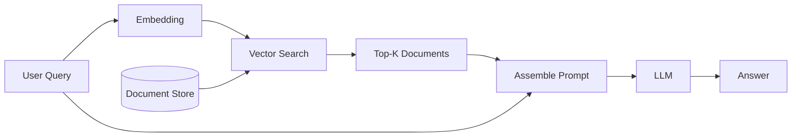

[← Previous Chapter](07-inference.md) | [Table of Contents](README.md) | [Next Chapter →](09-multimodal.md)

# Chapter 8: Embedding Models and RAG

## 8.1 Text Embeddings

### 8.1.1 What Are They

Map text to fixed-dimensional dense vectors such that semantically similar texts are close in vector space.

```
"The cat sat on the mat"    → [0.12, -0.34, 0.56, ...]  ∈ ℝ^768
"A kitten is on the rug"    → [0.11, -0.32, 0.55, ...]  ← close
"Stock prices rose sharply" → [0.87, 0.23, -0.45, ...]  ← far
```

**Applications**: Semantic search, document retrieval, clustering, deduplication, recommendations, RAG

### 8.1.2 Training Methods

**Contrastive Learning** (mainstream approach):

```python
# InfoNCE Loss (contrastive learning)
# Positive pairs (query, positive) should be close
# Negative pairs (query, negative) should be far

def infonce_loss(query, positive, negatives, temperature=0.05):
    pos_sim = cos_sim(query, positive) / temperature
    neg_sims = cos_sim(query, negatives) / temperature
    return -log(exp(pos_sim) / (exp(pos_sim) + sum(exp(neg_sims))))
```

**Training data construction**:
| Positive Source | Method |
|-----------|------|
| Title-body | Title is the query, body is the positive |
| QA pairs | Question → Answer |
| Translation pairs | English → Chinese |
| NLI | Entailment pairs are positives |
| LLM-generated | Use GPT-4 to generate synthetic pairs |

**Hard Negatives**: Critical for contrastive learning. Use BM25 or an existing model to retrieve documents that "look relevant but are incorrect" as negatives.

### 8.1.3 Two-Stage Training

```
Stage 1: Weakly-supervised pretraining
  - Large-scale title-body pairs, web anchor text
  - Millions to tens of millions of examples
  - Learn general semantics

Stage 2: High-quality fine-tuning
  - Human-annotated retrieval relevance data
  - NLI + STS + retrieval data
  - Tens of thousands to hundreds of thousands
  - Improve task-specific performance
```

### 8.1.4 SOTA Embedding Models

| Model | Dimensions | Context | Features |
|------|------|--------|------|
| [text-embedding-3-large](https://platform.openai.com/docs/guides/embeddings) (OpenAI) | 3072 | 8K | Commercial SOTA |
| [Voyage-3](https://www.voyageai.com/) | 1024 | 32K | Specialized for code/legal/finance |
| [BGE-M3](https://huggingface.co/BAAI/bge-m3) (BAAI) | 1024 | 8K | Multilingual + multi-granularity |
| [GTE-Qwen2](https://huggingface.co/Alibaba-NLP/gte-Qwen2-7B-instruct) (Alibaba) | 3584 | 128K | Based on Qwen2 |
| [E5-Mistral-7B](https://arxiv.org/abs/2401.00368) | 4096 | 32K | Based on Mistral |
| [NV-Embed-v2](https://huggingface.co/nvidia/NV-Embed-v2) (NVIDIA) | 4096 | 32K | Top of [MTEB](https://huggingface.co/spaces/mteb/leaderboard) leaderboard |
| [nomic-embed-text](https://huggingface.co/nomic-ai/nomic-embed-text-v1.5) | 768 | 8K | Open-source, small and efficient |

> Leaderboard: [MTEB (Massive Text Embedding Benchmark)](https://huggingface.co/spaces/mteb/leaderboard)

### 8.1.5 Training Your Own Embedding Model

```python
# Fine-tune with sentence-transformers
from sentence_transformers import SentenceTransformer, InputExample, losses

model = SentenceTransformer("BAAI/bge-base-en-v1.5")

train_examples = [
    InputExample(texts=["query", "positive doc"], label=1.0),
    InputExample(texts=["query", "negative doc"], label=0.0),
]

train_loss = losses.MultipleNegativesRankingLoss(model)
model.fit(
    train_objectives=[(train_dataloader, train_loss)],
    epochs=3,
    warmup_steps=100,
)
```

> Library: [sentence-transformers](https://github.com/UKPLab/sentence-transformers)

## 8.2 Vector Search

### 8.2.1 Vector Databases

| Database | Type | Features |
|--------|------|------|
| [FAISS](https://github.com/facebookresearch/faiss) (Meta) | Library | Fastest, GPU support, not a database |
| [Milvus](https://github.com/milvus-io/milvus) | Distributed | Production-grade, scalable |
| [Qdrant](https://github.com/qdrant/qdrant) | Service | Rust, high-performance, good filtering |
| [Weaviate](https://github.com/weaviate/weaviate) | Service | GraphQL API, multimodal |
| [ChromaDB](https://github.com/chroma-core/chroma) | Embedded | Simplest, good for prototyping |
| [Pinecone](https://www.pinecone.io/) | Managed | Fully managed, no ops needed |
| [pgvector](https://github.com/pgvector/pgvector) | PostgreSQL extension | Most convenient if you already use PG |

### 8.2.2 Index Types

```
Brute-force search (Flat):
  Exact, but O(n) — unacceptable beyond millions of vectors

IVF (Inverted File Index):
  Partition vector space into K clusters, search only the nearest few clusters
  Speed: O(n/K), Precision: ~95-99%

HNSW (Hierarchical Navigable Small World):
  Build a multi-layer graph, coarse search from top layers to fine search at bottom
  Very fast, high precision, but memory-heavy
  → Most commonly used index type

PQ (Product Quantization):
  Split vectors into sub-vectors, quantize each independently
  Massive memory compression (32x-64x), with some precision loss
  Good for very large scale (1B+)

Practical guidance:
  < 100K documents: Flat (brute-force is fine)
  100K - 10M: HNSW
  > 10M: IVF + PQ or HNSW + PQ
```

## 8.3 RAG (Retrieval-Augmented Generation)

### 8.3.1 Basic Flow



```python
# Minimal RAG implementation
import openai
import chromadb

# 1. Index documents
collection = chroma_client.create_collection("docs")
for doc in documents:
    embedding = openai.embeddings.create(input=doc, model="text-embedding-3-small")
    collection.add(documents=[doc], embeddings=[embedding.data[0].embedding], ids=[doc_id])

# 2. Retrieve + Generate
query = "What is the company's return policy?"
results = collection.query(query_texts=[query], n_results=5)

prompt = f"""Answer based on the following context:

{chr(10).join(results['documents'][0])}

Question: {query}"""

response = openai.chat.completions.create(
    model="gpt-4",
    messages=[{"role": "user", "content": prompt}]
)
```

### 8.3.2 RAG Optimization Techniques

```
Problem → Solution:

Inaccurate retrieval:
  → Hybrid Search (vector + BM25 keyword)
  → Reranker (re-rank top-K with a cross-encoder)
  → Query Expansion (use LLM to rewrite/expand the query)

Documents too long:
  → Chunking strategies: split by paragraph/sentence with overlap
  → Recursive splitting: first by heading, then paragraph, then sentence
  → Small-to-big: retrieve small chunks, return large chunks (with context)

Unfaithful answers:
  → Citation annotation: have the model cite which document each answer comes from
  → Faithful prompting: "Only answer based on the provided context"

Context window too small:
  → Map-reduce: summarize each document independently, then merge summaries
  → Long-context models (Gemini 1.5 2M, Claude 200K)
```

### 8.3.3 Advanced RAG Architectures

**Reranker (two-stage retrieval)**:
```
Stage 1: Bi-encoder (fast, retrieve top-100)
  query → embedding, doc → embedding, compute cosine similarity
  
Stage 2: Cross-encoder (slower but more accurate, select top-5 from top-100)
  [query, doc] → fed together into model → relevance score
  
Recommended rerankers: 
  - Cohere Rerank
  - bge-reranker-v2-m3
  - jina-reranker-v2-base-multilingual
```

**Agentic RAG**:
```
User query → Agent decides:
  → Need retrieval? → Retrieve → Answer
  → Need computation? → Code execution → Answer
  → Need multiple steps? → Plan → Multiple retrievals → Synthesize answer
  → Answer directly? → Use model knowledge
```

### 8.3.4 RAG Frameworks

| Framework | Features |
|------|------|
| [LangChain](https://github.com/langchain-ai/langchain) | Most popular, many components, but heavy abstractions |
| [LlamaIndex](https://github.com/run-llama/llama_index) | Focused on data indexing and retrieval |
| [Haystack](https://github.com/deepset-ai/haystack) | Pipeline-based design, production-friendly |
| Build your own | Recommended. RAG core logic is simple (embed → search → prompt) |

### 8.3.5 RAG vs Fine-Tuning vs Long Context

| Method | Best For | Advantages | Disadvantages |
|------|---------|------|------|
| **RAG** | Knowledge base that updates, need source citations | Data can be updated in real time, auditable | Retrieval quality is the bottleneck |
| **Fine-Tuning** | Changing model behavior/style/format | No runtime retrieval needed | Knowledge is hard to update |
| **Long Context** | QA over a few dozen documents | Simplest, no retrieval needed | Expensive, has upper limits |

**Practical advice**: The three approaches are often combined. Fine-tune to teach the model format and style, RAG for real-time knowledge, and long context for a small number of key documents.

## Key Papers

- [Devlin et al. (2018) — BERT](https://arxiv.org/abs/1810.04805) — encoder paradigm and the [CLS] representation
- [Reimers & Gurevych (2019) — Sentence-BERT](https://arxiv.org/abs/1908.10084) — the standard recipe for dual-encoder retrieval
- [Karpukhin et al. (2020) — DPR](https://arxiv.org/abs/2004.04906) — Dense Passage Retrieval
- [Khattab & Zaharia (2020) — ColBERT](https://arxiv.org/abs/2004.12832) — late interaction, token-level matching
- [Lewis et al. (2020) — RAG](https://arxiv.org/abs/2005.11401) — the original retrieval-augmented generation paper

## Further Reading

- [BGE Embedding family](https://github.com/FlagOpen/FlagEmbedding) — open-source embedding SOTA
- [LangChain](https://github.com/langchain-ai/langchain) / [LlamaIndex](https://github.com/run-llama/llama_index) — RAG orchestration frameworks
- [Chroma](https://www.trychroma.com/) / [Qdrant](https://qdrant.tech/) / [Milvus](https://milvus.io/) — vector database options

## Exercises

1. **MTEB-style eval**: compare BGE-large-zh vs OpenAI text-embedding-3-large on your own corpus, measuring retrieval@5.
2. **Chunking ablation**: with the model fixed, sweep chunk size {256, 512, 1024} and overlap {0, 64, 128}; measure QA accuracy.
3. **Hybrid search**: implement weighted fusion of BM25 + dense; tune the weight and quantify improvement over dense-only.

---

[← Previous Chapter](07-inference.md) | [Table of Contents](README.md) | [Next Chapter →](09-multimodal.md)
