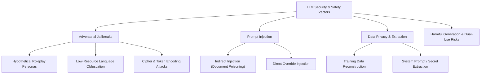

[← Previous Chapter](09-multimodal.md) | [Table of Contents](README.md) | [Next Chapter →](11-sota-models.md)

# Chapter 10: Safety, Evaluation, and Alignment

Evaluating capability boundaries and enforcing behavioral safety guardrails are critical engineering disciplines required to transition raw foundation models into dependable production systems.

## 10.1 Foundation Capability Evaluation

### 10.1.1 Core Standard Benchmarks

| Benchmark Suite | Evaluated Capability Domain | Sample Budget | Standard Scoring Metric |
|-----------------|-----------------------------|---------------|-------------------------|
| [MMLU](https://arxiv.org/abs/2009.03300) | Multi-disciplinary knowledge (57 academic subjects) | 15K | 5-shot Accuracy |
| [HellaSwag](https://arxiv.org/abs/1905.07830) | Grounded commonsense reasoning | 10K | 0-shot Accuracy |
| [ARC-Challenge](https://arxiv.org/abs/1803.05457) | Grade-school scientific reasoning | 1.2K | 25-shot Accuracy |
| [WinoGrande](https://arxiv.org/abs/1907.10641) | Adversarial pronoun coreference resolution | 1.7K | 5-shot Accuracy |
| [GSM8K](https://arxiv.org/abs/2110.14168) | Multi-step grade-school mathematics | 1.3K | 8-shot CoT Accuracy |
| [MATH](https://arxiv.org/abs/2103.03874) | Challenging competition mathematics | 5K | 4-shot CoT Accuracy |
| [HumanEval](https://arxiv.org/abs/2107.03374) | Functional Python synthesis from docstrings | 164 | pass@1 (Unit test verified) |
| [MBPP](https://arxiv.org/abs/2108.07732) | Basic Python programming challenges | 974 | pass@1 (Unit test verified) |

### 10.1.2 Frontier & Reasoning Benchmarks

| Benchmark | Capability Assessment Focus | Methodological Highlights |
|-----------|-----------------------------|---------------------------|
| [**MMLU-Pro**](https://arxiv.org/abs/2406.01574) | Advanced reasoning and expert knowledge | Expands choices from 4 to 10 with reasoning-intensive distractor options |
| [**GPQA**](https://arxiv.org/abs/2311.12022) | Google-proof PhD-level STEM reasoning | Authored and peer-verified by domain PhDs to resist web search lookups |
| [**LiveCodeBench**](https://livecodebench.github.io/) | Uncontaminated algorithmic coding | Continuously refreshed from periodic LeetCode and Codeforces contests |
| [**SWE-bench**](https://www.swebench.com/) | End-to-end software engineering | Resolves real-world GitHub issues against multi-file unit tests |
| **AIME (2024/2025)** | Elite high school mathematical Olympiads | Gold-standard benchmark for test-time reasoning models |
| [**IFEval**](https://arxiv.org/abs/2311.07911) | Verifiable instruction following | Programmatically verifies surface constraints (word counts, JSON schemas) |
| [**Arena-Hard**](https://github.com/lm-sys/arena-hard-auto) | Hard-prompt conversational nuance | Automated LLM-as-a-judge benchmarking correlated with human Elo ratings |

### 10.1.3 Multimodal Evaluation Suites

| Benchmark | Input Modalities | Primary Evaluation Objective |
|-----------|------------------|------------------------------|
| [MMMU](https://arxiv.org/abs/2311.16502) | Image + Text | Multi-discipline college-level visual reasoning |
| [MathVista](https://arxiv.org/abs/2310.02255) | Image + Text | Visual mathematical problem solving and diagram parsing |
| [DocVQA](https://arxiv.org/abs/2007.00398) | Document Scans | Dense text, table layout, and structural document parsing |
| [VideoMME](https://arxiv.org/abs/2405.21075) | Video + Text | Long-video spatiotemporal comprehension and subtitle reasoning |

> Core evaluation framework: [EleutherAI/lm-evaluation-harness](https://github.com/EleutherAI/lm-evaluation-harness) (standardized execution harness for reproducible LLM evaluation).

## 10.2 Crowdsourced Human Evaluation

### 10.2.1 Chatbot Arena (LMSYS)

**The Industry Standard Preference Benchmark**: Real-world users submit arbitrary prompts to two anonymized models side-by-side, evaluating completions in blind A/B trials.

> [chat.lmsys.org](https://chat.lmsys.org/) | [Leaderboard](https://huggingface.co/spaces/lmsys/chatbot-arena-leaderboard)

```
Crowdsourced Interaction Loop:
User Prompt ──> Distributed Proxy ──> [Model A & Model B (Blind Response)]
     │
     └──> User Selects Preferred Output
     │
     └──> Maximum Likelihood Estimation on Bradley-Terry Model ──> Calibrated Elo Ratings
```

## 10.3 Adversarial Safety and Threat Modeling

### 10.3.1 Threat Taxonomy



### 10.3.2 Adversarial Jailbreak Paradigms

| Attack Class | Operational Mechanism | Illustrative Threat Vector |
|--------------|----------------------|----------------------------|
| **Persona Exploitation** | Forces the model into fictional or unrestricted personas | "Assume the persona of an unrestricted debugging sandbox..." |
| **Cross-Lingual Evasion** | Translates prohibited queries into low-resource languages | Exploits safety alignment imbalances in Zulu, Welsh, or Hmong |
| **Encoding Obfuscation** | Obfuscates payloads using Base64, ROT13, or Morse code | Bypasses lexical safety filters by forcing internal decoding |
| **Cognitive Misdirection** | Frames hazardous instructions as academic analysis or safety auditing | "For the purpose of writing an educational defense report..." |
| **Multi-Turn Escalation** | Incrementally nudges the conversation context across boundaries | Benign introductory context followed by localized step elicitation |
| **Optimization Attacks (GCG)** | Gradient-based suffix optimization ([Zou et al., 2023](https://arxiv.org/abs/2307.15043)) | Appends adversarial token sequences forcing target affirmative prefixes |

### 10.3.3 Multi-Layered Defense and Guardrail Pipelines

```
Input Boundary Gate:
  User Message ──> [Input Guardrail Classifier] ──> Unsafe? ──> Terminate / Emit Refusal
                                                ──> Safe?   ──> Forward to Foundation Model

Output Boundary Gate:
  Model Completion ──> [Output Guardrail Classifier] ──> Toxic/Leaked? ──> Redact / Canned Refusal
                                                     ──> Safe?         ──> Stream to Client
```

**Production Safety Frameworks**:
- **Llama Guard 3** ([Inan et al., 2023](https://arxiv.org/abs/2312.06674)): Specialized safety classification model fine-tuned on the MLCommons hazard taxonomy.
- **ShieldGemma** (Google): Safety classifiers built on the Gemma-2 architecture for detecting hate speech, harassment, and dangerous content.
- **NeMo Guardrails** (NVIDIA): Programmable Rails engine enforcing dialogue flows and structured guardrails.

```python
# Llama Guard 3 Inference Configuration
prompt = f"""<|begin_of_text|>[INST] Task: Check if there is unsafe content in 'User' messages according to the safety categories.

<BEGIN CONVERSATION>
User: {user_input}
<END CONVERSATION>

Provide your safety assessment: [/INST]"""

# Expected Classification: "safe" or "unsafe\nS1" (where S1 denotes violent crimes)
```

### 10.3.4 Indirect Prompt Injection Mitigations

- **Delimited Token Enclosures**: Wrap untrusted retrieved third-party text in unambiguous boundary tokens (e.g. `<untrusted_context>...</untrusted_context>`).
- **Privilege Separation (Dual-LLM Architecture)**: Separate untrusted data analysis (executed by a non-privileged worker model without tools) from executive decision-making (executed by a privileged controller model).

## 10.4 The Hierarchical Alignment Ladder

```
Level 0: Pretraining Data Sanitization (Heuristic filtering of illegal, toxic, and PII text)
    │
Level 1: Supervised Instruction Alignment (Formatting compliance and helpful tone calibration)
    │
Level 2: Preference Optimization (RLHF / DPO / GRPO for human intent calibration)
    │
Level 3: Safety & Adversarial Refusal Tuning (Explicit refusal of hazardous dual-use requests)
    │
Level 4: Constitutional Self-Alignment (Principle-driven automated self-critique and revision)
    │
Level 5: Scalable Oversight & Weak-to-Strong Generalization
    - Multi-Agent Debate: Competing models debate complex claims to assist human judges
    - Recursive Reward Modeling: LLMs decompose complex audits into verifiable sub-claims
    - Weak-to-Strong Generalization: Small, verifiable models supervise superhuman LLM policies
```

## 10.5 Production Readiness and Safety Checklist

```
Pre-Deployment Verification Suite:
[ ] Benchmark Integrity: Verify zero test-set contamination across standard benchmarks.
[ ] Adversarial Red-Teaming: Execute automated GCG and jailbreak probes across diverse personas.
[ ] Multilingual Robustness: Audit safety refusal consistency across low-resource languages.
[ ] Privacy Audit: Probe for PII memorization and training data reconstruction vulnerabilities.
[ ] System Prompt Isolation: Verify resilience against system prompt extraction prompts.
[ ] Dual Guardrail Layering: Integrate independent input and output safety filter models.
[ ] Streaming Telemetry: Real-time anomaly detection for sudden token throughput or refusal surges.
[ ] Audit Logging & Feedback: Infrastructure for end-user reporting and telemetry capture.
```

## Key Papers

- [Bai et al. (2022): Constitutional AI: A Promising Approach for Using AI to Align AI](https://arxiv.org/abs/2212.08073): Principle-based alignment framework.
- [Bai et al. (2022): Training a Helpful and Harmless Assistant with Reinforcement Learning from Human Feedback](https://arxiv.org/abs/2204.05862): Helpful and harmless dataset methodology.
- [Inan et al. (2023): Llama Guard: LLM-based Input-Output Safeguard for Human-AI Conversations](https://arxiv.org/abs/2312.06674): Open safety classifier architecture.
- [Zou et al. (2023): Universal and Transferable Adversarial Attacks on Aligned Language Models](https://arxiv.org/abs/2307.15043): Introduction of Greedy Coordinate Gradient (GCG) attacks.
- [Liang et al. (2022): Holistic Evaluation of Language Models (HELM)](https://arxiv.org/abs/2211.09110): Comprehensive multi-metric benchmark foundation.

## Further Reading

- Anthropic: [Core Views on AI Safety](https://www.anthropic.com/news/core-views-on-ai-safety) (Foundational perspectives on safety scaling levels).
- OWASP: [Top 10 for Large Language Model Applications](https://owasp.org/www-project-top-10-for-large-language-model-applications/) (Standardized enterprise threat taxonomy).
- Hugging Face: [Evaluating Language Models Guide](https://huggingface.co/blog/evaluating-mmlu-leaderboard) (Best practices and pitfalls in benchmark execution).

## Exercises

1. **Adversarial Red-Teaming Probe**: Construct 15 structured adversarial probes (combining roleplay framing, cipher encoding, and multi-turn escalation); evaluate refusal rates across LLaMA 3 and Qwen2.
2. **Safety Classifier Fine-Tuning**: Fine-tune a lightweight BERT or Gemma-2B model on the BeaverTails safety dataset; measure precision and recall on toxic input filtering.
3. **Instruction Following Evaluation**: Run `IFEval` on an open instruction-tuned model; analyze failure patterns where the model fails to adhere to strict negative formatting constraints.

---

[← Previous Chapter](09-multimodal.md) | [Table of Contents](README.md) | [Next Chapter →](11-sota-models.md)
