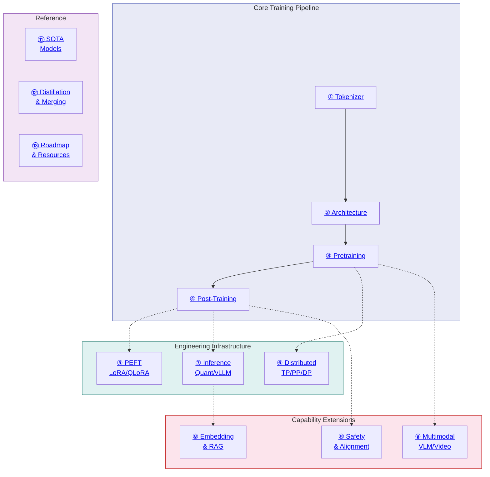

# The Complete LLM Training Engineer Guide

> From Tokenizer to Post-Training, from single GPU to 10K-GPU clusters, from text to multimodal.

A comprehensive guide for engineers who want to master the full stack of LLM training. Covers theory, engineering, SOTA, and hands-on practice.

**[中文版 / Chinese Version](../README.md)**

## Overview: From Data to Deployment

```mermaid
flowchart LR
    subgraph DATA["<b>① Data</b>"]
        D1["Web Crawl\nWikipedia\nCode/Math"] --> D2["Cleaning\nDedup\nFiltering"]
    end

    subgraph TOK["<b>② Tokenizer</b>"]
        D2 --> T1["BPE / Unigram\nVocab Training"]
        T1 --> T2["Token IDs"]
    end

    subgraph PRE["<b>③ Pretraining</b>"]
        T2 --> P1["Transformer\nGQA · MoE · MLA\nRoPE · SwiGLU"]
        P1 --> |"Next Token\nPrediction"| P2["Base Model"]
    end

    subgraph POST["<b>④ Post-Training</b>"]
        P2 --> S1["SFT\nInstruction Tuning"]
        S1 --> S2["RLHF / DPO\nPreference Opt."]
        S2 --> S3["Safety\nTraining"]
    end

    subgraph DEPLOY["<b>⑤ Deployment</b>"]
        S3 --> Q1["Quantization\nINT4/FP8"]
        Q1 --> Q2["Serving\nvLLM · SGLang"]
    end

    style DATA fill:#e3f2fd,stroke:#1565c0,color:#0d47a1
    style TOK fill:#e3f2fd,stroke:#1565c0,color:#0d47a1
    style PRE fill:#e8eaf6,stroke:#283593,color:#1a237e
    style POST fill:#fff3e0,stroke:#e65100,color:#bf360c
    style DEPLOY fill:#e8f5e9,stroke:#2e7d32,color:#1b5e20
```



## Knowledge Map: Chapter Dependencies



## Table of Contents

| # | Chapter | Topics |
|---|---------|--------|
| 1 | [Tokenizer](01-tokenizer.md) | BPE, WordPiece, Unigram, multilingual, byte-level |
| 2 | [Architecture](02-architecture.md) | Transformer, RoPE, GQA, MoE, MLA, Scaling Laws |
| 3 | [Pretraining](03-pretraining.md) | Data pipeline, objectives, optimizer, stability, long context |
| 4 | [Post-Training](04-post-training.md) | SFT, RLHF, DPO, GRPO, Reasoning Models |
| 5 | [PEFT](05-peft.md) | LoRA, QLoRA, Adapters, practical tips |
| 6 | [Training Infrastructure](06-infra.md) | GPU, TP/PP/DP/EP, frameworks, fault tolerance, MFU |
| 7 | [Inference & Deployment](07-inference.md) | KV Cache, quantization, vLLM, Speculative Decoding, cost |
| 8 | [Embedding & RAG](08-embedding-rag.md) | Embedding models, vector search, RAG pipeline |
| 9 | [Multimodal](09-multimodal.md) | VLM, image generation, audio, video, Omni Models |
| 10 | [Safety & Alignment](10-safety-alignment.md) | Benchmarks, Red Teaming, Guardrails, structured output |
| 11 | [SOTA Models](11-sota-models.md) | LLaMA 3, DeepSeek, Claude, Gemini, GPT-4, Qwen |
| 12 | [Distillation & Merging](12-distillation-merging.md) | KD, TIES, DARE, mergekit |
| 13 | [Practical Roadmap](13-roadmap.md) | Learning path, paper list, resources, hardware, cost |

## Training Cost Reference

| Model Size | Hardware | Tokens | Est. Cost | Time |
|------------|----------|--------|-----------|------|
| 1B | 1x A100 80GB | 20B | ~$500 | ~2 days |
| 7B | 8x A100 80GB | 1T | ~$50K | ~2 weeks |
| 13B | 32x A100 80GB | 2T | ~$200K | ~3 weeks |
| 70B | 256x H100 | 2T | ~$2M | ~1 month |
| 405B | 16384x H100 | 15T | ~$50M+ | ~2 months |
| 671B MoE | 2048x H800 | 14.8T | ~$5.5M | ~2 months |

> Last row is DeepSeek-V3 — MoE architecture dramatically reduces cost.

## Companion Code

Runnable examples live in **[llm-tutorial-code](https://github.com/yingwang/llm-tutorial-code)** — one folder per chapter, starting with BPE / attention from scratch and growing toward pretrain / SFT / DPO / LoRA / inference serving.

## Glossary

Unsure about an acronym? See the **[Glossary](00-glossary.md)** — 80+ entries covering architecture, training, PEFT, infra, inference, RAG, multimodal, and more.

## Getting Started

If you're new to LLM training, read in this order:

1. [Chapter 1: Tokenizer](01-tokenizer.md) — understand the input
2. [Chapter 2: Architecture](02-architecture.md) — understand the model
3. [Chapter 13: Roadmap](13-roadmap.md) — know what to learn and which tools to use
4. Get hands-on: run [nanoGPT](https://github.com/karpathy/nanoGPT)
5. Come back and read the rest

If you already have a foundation, jump to any chapter that interests you.

## Key Links

| Resource | Link |
|----------|------|
| nanoGPT | [github.com/karpathy/nanoGPT](https://github.com/karpathy/nanoGPT) |
| HuggingFace TRL | [github.com/huggingface/trl](https://github.com/huggingface/trl) |
| vLLM | [github.com/vllm-project/vllm](https://github.com/vllm-project/vllm) |
| Megatron-LM | [github.com/NVIDIA/Megatron-LM](https://github.com/NVIDIA/Megatron-LM) |
| Flash Attention | [github.com/Dao-AILab/flash-attention](https://github.com/Dao-AILab/flash-attention) |
| LLM Evaluation | [github.com/EleutherAI/lm-evaluation-harness](https://github.com/EleutherAI/lm-evaluation-harness) |
| Chatbot Arena Leaderboard | [huggingface.co/spaces/lmsys/chatbot-arena-leaderboard](https://huggingface.co/spaces/lmsys/chatbot-arena-leaderboard) |

## Author

Ying Wang

## Citation

If this tutorial is helpful to your work, please cite:

```bibtex
@misc{wang2026llmtutorial,
  author = {Ying Wang},
  title  = {LLM 训练工程师完全指南 / The Complete LLM Training Engineer Guide},
  year   = {2026},
  url    = {https://github.com/yingwang/llm-tutorial}
}
```

## License

This repository is **dual-licensed**:

- **Prose and diagrams** (Mermaid flowcharts, explanatory text, chapter content): [CC BY-NC-SA 4.0](../LICENSE) — Attribution · NonCommercial · ShareAlike
- **Code snippets** (Python/Bash examples within chapters): [MIT](../LICENSE-CODE) — free to use, including commercial, with copyright notice retained

Copying code examples from this repository for learning or engineering work is not subject to the non-commercial restriction.

---

> Last updated: 2026-04-25
